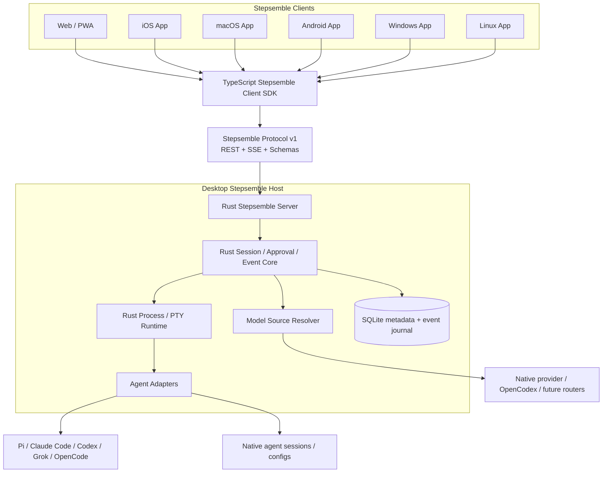

# Stepsemble 跨平台完整體架構與執行計畫

> 狀態：已接受（Accepted）
> 計畫版本：1.61
> 最後更新：2026-09-09
> 當前產品基線：Stepsemble 3.0.6（由 Pi Harbor 2.13.2 相容遷移）
> Mini／MacBook Pro 啟用版本：3.0.6／source `331b9f0`（2026-09-06 已部署並公開 stable release）
> 當前實作：Node.js 22.19+ ＋無建置步驟的 JavaScript PWA
> 長期目標：Rust Host Core ＋ TypeScript 跨平台 Client ＋ Tauri 2 App Shell

## 文件用途與回復方法

**持續執行（2026-09-08）**：Jerome 已要求開啟 loop，產品 goal 已啟用。
本階段以 Web 完整可驗收／安全發布為終點，逐項驗收與接續入口見
[Web 完整體執行清單](web-completion-loop.md)。不是整套完成宣告，也不取代本計畫、
既有私人來源／模型／正式部署關卡或獨立 72h 長測；未來原生 App 仍依既定分期。

**最新增量 1.61（開發版仍3.0.7-rc.7，未部署）**：Codex capture→背景bytes parser
共用Host持有的reader admission，兩階段到actualclose才釋放，取消/逾時/unknown cleanup
跨consumer隔離。最低Node真Rust＋ClaudeSDK＋Codexparser同budget max2/remaining0，
原文頁/版本/實際取消通。本機845/0fail、最低Node114/114；首批CI抓到Windows路徑
JSON escaping的測試斷言錯誤，已加跨OS資料並修正，修正SHA的CI待核；native三OS已通。
約8MiB合成index的main-loop gap由87–94ms降到6–8ms，但整次I/O+解析仍約0.76秒，
非Web/RSS/完整Host效能驗收。詳[背景解析](codex-history-pipeline.md)；沒有Codex
source grant/registry/HTTPWeb、SQLite最終name或壓縮能力，C1–C8仍未全完。
正式/B+/私人/帳號/固定72h不動。

**前一增量 1.60（開發版仍3.0.7-rc.7，未部署）**：有界Codex名稱索引解析已接owned
Rust capture bytes，依固定版本分開latest/read/list候選、Unicode/UUID/duplicates/缺空狀態，
不把index冒充最終native title。真CLI17cases＋最低Node及另五輪通，發現preview同名的
read/list差異；SQLite distincttitle仍可優先，尚未capture/驗該來源。本機823/0fail、
最低Node26/26；exact f884843三CI全過並核logs，一般三OS823/0fail、native各17cases、
reader各92tests與POSIX實際capture→name/Windowsunsupported、audit0known0warnings。
詳[名稱索引與API差異](codex-name-index.md)；
Codex完整name/opt-in/discovery/壓縮/HostWeb及C1–C8仍待，正式/B+/私人/帳號/72h不動。

**前一增量 1.59（開發版仍3.0.7-rc.7，未部署）**：Codex selected rollout＋固定name
index的Rust v3成組capture已實作，active/archive/reverted locator分開，兩份bytes各自
identity/SHA/缺空狀態和sourceVersion綁定；fd/ACL/localmount/雙讀/替換檢查，不宣稱
原子交易。Node同helper single-flight/actualclose/quarantine，真Rust→raw頁owned鏈通。
本機Rust25/25、完整Node816/0fail、最低Node38/38，舊Claude actualHost鏈通；exact
ebe9a8e五CI已核實：三OS一般816/0fail、reader新POSIXpair與Windows實際unsupported、
rolling雙OS各24cases。NativeCodex Linux首次下載reset，保留紀錄並只重跑失敗job後通。
沒有name語意解析、壓縮解碼、Codex opt-in/discovery/HostWeb或完整native投影，
詳[Codex來源capture](codex-source-capture.md)。正式/B+/私人/帳號/固定72h不動，C1–C8未全完。

**前一增量 1.58（開發版仍3.0.7-rc.7，未部署）**：已定位Codex command/image缺項
為固定legacy API套用persistence policy後排除transient事件；parse errors0，非猜測JSON。
新增bytes-only raw記錄快照／分頁，原文與CRLF/未知欄位/工具保留，8MiB/8192records、
50筆/272KiB、有界且handle/revision隔離、release不可逆。真CLI owned raw113頁/219records
byte-exact，保留三筆被省略事件；原生缺項gate仍未過，不假装完整native投影或已接Web。
首批三OS一般CI805/0fail，但native Linux啟動通知失敗；已隔離重現並精確驗證
一次缺system-bwrap通知與timestamp，其他警告/effects仍拒絕。本機增至808/0fail、
最低Node40/40。修正607677b的一般CI34245329559三OS808/0fail，以及固定真CLI
CI34245329521三OS均已通、完整logs核實，缺項/unavailable仍明示；詳
[Codex原始記錄保留](codex-rollout-preservation.md)。source ACL/capture/Host及C1–C8仍待，
正式/B+/私人/帳號route/固定72h不動。

**前一增量 1.57（開發版仍3.0.7-rc.7，未部署）**：本機owner設定精靈提供繁中/英文
逐欄修正、完整scope/readers摘要、CREATE後exclusive私有新檔。review immutable/單次，
root/artifact/parent改變拒絕、partial write不刪競爭者檔案，原非互動命令相容且可選多讀者。
真TTY建立/取消已驗，最低Node真Rust/SDK/Host使用精靈原檔通actualSetupGate；本機794tests/0fail。
沒有Web設定寫入API或替owner選私人root/readers，不scan/登入/重啟，C1與C2–C8仍未完成；
詳[owner設定與驗證](history-owner-setup.md)。四組exact CI已通，一般三OS794/0fail、
POSIX新actualSetupGate passed、rolling雙OS各24cases；正式與獨立72h不動。

**前一增量 1.56（開發版3.0.7-rc.7，未部署）**：完整唯讀歷史 UI 的 119 keys／11語
已接實際頁及preview；只翻譯明確UI，原生名稱/摘要/訊息/JSON/時間不變。頁首語言
選擇沿用workspace、只作用本頁，不寫回設定或觸發歷史操作。CUA找出並修正語言
切換時重複計算瀏覽器scroll anchoring的跳動；320px十一語／390px繁中工具歷史已驗。
本機777tests/0fail、最低Node57/57，exact四組CI全過（browser雙OS各24cases）；真機/跨Host/人工校稿及
C1–C8整體仍未完成，詳[歷史多語言](history-localization.md)。正式與獨立72h不動。

**前一增量 1.55（開發版仍3.0.7-rc.6，未部署）**：Codex 原生歷史新增有界、
不可執行的 observation 轉換與完整性檢查；保留 native name/session ID、原始項目、
錯誤及未知欄位，不合成 approval 或執行事件。19 種標籤的保留測試通過，真 CLI
工具 fixture 實際只還原 6 種，command/image 缺口明示 unavailable，根因尚未確定；
不能說完整工具歷史已通過。官方文件亦確認 paginated 完整歷史尚未支援，先停止
追求以手改 store 繞過的路徑。13 個新測試／本機總 768 tests、0 fail，真 CLI
兩個 Node 版本均 model endpoint 0／11 原檔不變／cleanup 確認；尚未接 Host/Web。
詳細正反向證據見 [Codex 歷史相容性](codex-history-compatibility.md)。

**前一增量 1.54（開發版仍3.0.7-rc.6，未部署）**：C2新增固定Codex0.153.4的受限
read-only RPC及真CLI owned-home歷史runner，10個補充schema固定；7個legacy對話
49turns／147items、完整原生名稱、主/subagent來源與封存分頁、模型endpoint0及
actual-close／10原檔不變已驗。發現items/list實際-32601，paginated JSONL-only
缺name與store projection，明確記為未支援，不假裝全歷史已接。沒有私人來源、
Host/Web接線、session/resume/approval或部署；詳[Codex歷史相容性](codex-history-compatibility.md)。

**前一增量 1.53（開發版3.0.7-rc.6，未部署）**：source-group Web來源選擇、明確
refresh、50列snapshot分頁與手機內捲動已接實際Host；只逐一載入可見名稱，保留
原生title/summary分離及完整原文展開。名稱更新不重建列或內容，切換等待舊內容清理、
只開最新選擇；stale/取消/撤銷/背景暫停與manual fallback已實作。合成Host CUA
320/390px、64來源、改名/內容/焦點已驗，本機742tests/0fail；新增Mac/Linux各六組
明暗/尺寸native browser CI已通，exact SHA分層證據見來源群組文件。
HTML入口改revalidate避免更新後沿用舊版本資源。沒有私人來源、
正式部署或72h變動；C1整體與C2–C8仍未完成。見[來源群組接線](history-source-groups.md)。

**前一增量 1.52（開發版3.0.7-rc.5，未部署）**：原生名稱使用固定Claude SDK
`getSessionInfo`＋既有captured SessionStore取得；customTitle與summary分開，缺名不冒充。
名稱與內容共用兩flight／64registry slots，HTTP/relay回傳前再驗indexed identity及
snapshot/reader權限。TypeScript sources/catalog/metadata transport已實作並通真Host鏈；
Web來源操作與lazy名稱呈現尚未接線，C1及其餘完整體gate未完成。見[來源群組接線](history-source-groups.md)。

**前一增量 1.51（開發版仍3.0.7-rc.5，未部署）**：source-group v2設定、readers範圍、
Host同instance接線、dynamic resolver／增改刪撤銷與50列snapshot分頁已接入實際HTTP及
dedicated relay。最低Node22.19真Rust→source-catalog→dynamic bind→SDK合成Host鏈已驗；
沒有新增私人來源。原生title明示not_loaded，Web來源UI／其他harness仍待，不能說C1已完。
見[來源群組接線](history-source-groups.md)。

**前一增量 1.50（開發版仍3.0.7-rc.5，未部署）**：inventory與content現在可共用
Host持有的兩個reader名額；capture→SDK不提前釋放，unknown close永久quarantine
並停止其他來源，Host shutdown合併共享清理結果。最低Node22.19真Rust＋SDK並行
合成鏈已驗，physical max2／remaining0；source-group設定／dynamic registry／Web
仍待接上同一budget。見[共用reader限額](history-reader-admission.md)。

**前一增量 1.49（開發版仍3.0.7-rc.5，未部署）**：Rust已新增explicit-root的
Claude主對話metadata雙掃，Host-private索引可辨識增改刪、穩定ID與失敗stale保留。
本批只做安全來源探索核心，未接來源設定／動態registry／Web，沒有讀取私人history、
取得原生title或完成全來源自動收錄。下一步接來源一次授權、global admission、原生
metadata／catalog分頁與按需讀取；詳見[原生來源探索](native-history-discovery.md)。

**前一增量 1.48／3.0.7-rc.5（開發候選、未部署）**：已加入同主機 Pi 歷史＋
Stepsemble 多 Agent 工作的統一清單，來源／類型篩選、搜尋、50列分頁、獨立捲動，
及慢回覆跨主機執行狀態隔離。這是既有來源的**呈現索引**，不是其他原生CLI歷史的
自動探索、完整歷史或續跑實作。其餘來源一次授權／增量探索、native approval/resume、
durable journal、Windows原生reader與App仍待；不要將新清單稱為「全部已完成」。
詳見 [統一清單的範圍與驗收](conversation-catalog.md)。正式3.0.6與固定ab227af長測不變。

這份文件是 Stepsemble 從 Web App 發展為跨平台 Coding Agent 工作區的長期計畫與決策來源。它的目的是讓後續對話即使經過 session 壓縮、開啟新 session，或換由其他 agent 執行，仍可恢復已確認的方向，不需要重新推導。

未來開始任何架構、跨平台、session、approval、agent adapter、model routing 或 Rust 遷移工作前，依序：

1. 完整讀取本文件。
2. 完整讀取 [`docs/current-system-inventory.md`](current-system-inventory.md)，確認相容性基線與已知缺口。
3. 讀取 [`docs/architecture.md`](architecture.md)，確認目前已上線的架構。
4. 涉及效能時讀取 [`docs/performance-baseline.md`](performance-baseline.md) 與其 raw JSON。
5. 檢查 `git status --short`、`package.json` 版本與現有測試。
6. 從本文件的「當前執行狀態」找到下一個未完成項目。
7. 只在前一階段驗收條件通過後，才進入下一階段。
8. 每次實質進展都要同步更新「當前執行狀態」與「變更記錄」。

[`docs/architecture.md`](architecture.md) 描述「當前已上線的真實狀態」；本文件描述「已確認的目標架構與遷移順序」。兩者不得混為一談。

## 當前執行狀態

| 項目 | 狀態 | 說明 |
| --- | --- | --- |
| Web 正式上線／品牌介面整理 | 3.0.6 已在兩台 Mac 上線並公開 | exact `331b9f0` 三OS CI／雙平台 rolling 全綠；停止確認、選取不重建及還原保護已上線，既有巢狀捲動與品牌原圖保留；兩台更新器正常。見 `agent-stop-reliability.md` |
| 長期語言邊界 | 已定案 | Rust Host Core；TypeScript UI/Client；Swift/Kotlin 僅處理平台專屬能力 |
| Web 產品定位 | 已定案 | Web/PWA 永久保留，不是過渡版 |
| 產品名稱與識別 | B+ 向量母版已定案，rc.2候選驗收通過 | Stepsemble；step + ensemble。Jerome於2026-09-07確認B+：同一模組與藍紫內緣精確旋轉四次、一般版四邊16%、maskable另留安全區；3.0.7-rc.2本機／瀏覽器／三OS CI／rolling全綠，不代表已部署 |
| Host/Client 邊界 | 已定案 | Desktop 可為 Host + Client；iOS/Android 初期只為 Client |
| 對話來源辨識 | rc.4 已實作，未部署 | 共用 allowlisted Agent 圖示：Pi、Claude Code、Codex、OpenCode、Grok Build；列表／Hub／工作中心／標題；模型不冒充 Agent，未知來源中性 fallback。GPT/ChatGPT 僅預留呈現映射，未新增 connector。見 `agent-identity.md` |
| App Shell | 目標已定，待驗證 | Tauri 2 為預設方案；必須先通過 Apple 實機 PoC 驗收門檻 |
| 當前回歸基線 | 3.0.6 發布 gate 全通過 | `331b9f0`／CI34027897400三OS335tests／0fail（Mac333pass2skip、Win325/10、Linux332/3）；rolling34027897382兩OS各15cases；Release34028079034全綠。原Windows stop race已修，見 `agent-stop-reliability.md` |
| Pi Failed／session 名稱修正 | 已隨3.0.4部署 | 已分離預期 idle close 與異常退出、補上送出／關閉競爭保護，名稱統一 native name／first user；驗證與相容邊界見 `pi-session-lifecycle.md`。未呼叫真實模型或改寫歷史 |
| 開發分支跨平台回歸 | 已通過，逐批驗證 | 2026-09-05 `6a0ddd4`／CI33970842907三OS全綠270tests/0fail；Rolling33970842871 macOS/Linux各8cases全綠。Native Pi offline contract33967509738三OS實跑0.84.2各57frames；本批見1.23記錄，新的commit需看各自workflow；不等於model/provider parity或release |
| 現行系統盤點 | 已完成 | HTTP/SSE/RPC、資料、狀態、approval、event、安裝與 rollback 已落於 `current-system-inventory.md` |
| 本機品牌遷移 | 已部署 | Mac Mini 已由 2.13.2 原地升級至 3.0.0；session/token/SSH launcher/CUA driver 均完成前後核對 |
| 跨平台 installer smoke | 部分完成 | macOS live migration、Linux clean-container install、Windows PowerShell AST 通過；Linux systemd/Windows Scheduled Task real runner 待補 |
| Host 效能基線 | 已完成 | 2.13.2 與 clean source commit `39e671d` 的 3.0.0 都以 301 synthetic sessions、41,000 messages、8 generic tasks 實測；結果見 `performance-baseline.md` |
| Browser 效能基線 | 已量測，保留缺口 | Chrome DevTools 已連線；cold/warm、長 session、30 秒串流、mobile 4× CPU、network/accessibility 見 `browser-performance-baseline.md`；標準 TBT 與完整 trace export 待補 |
| 階段 0：計畫與基線 | 基線可供後續比較 | 已記錄長對話 INP 537 ms、mobile restore LCP 4859 ms、串流收尾長任務；這不是順滑度驗收通過 |
| 階段 1：Stepsemble Protocol v1 | 進行中 | handshake／strict TS SDK／35 events＋8 commands、receipt／entity／bounded history／snapshot、多列proposal／observed-fact邊界、30-step synthetic transaction golden與1,251-case Ajv conformance已實作；Pi0.84.2三OS真實離線57frames已驗；實際native ownership/evidence驗證／durable ledger／snapshot transport／rolling gate仍未通過 |
| Pi 原生 RPC 邊界 | 已實作，隨rc.3啟用於Mini | 嚴格 frame／UI reply、跨程序 correlation、有界 pending dialog、TypeScript FIFO／失敗手動重試、完整 pending-set 重連對齊／舊 stream fencing、更新／idle／離開聊天保護；Windows core launch／PATH／owned tree 已接上 runner fixture；仍非 durable approval 或原生全版本／provider／模型串流驗收 |
| 已發佈 Web rolling 相容 | Legacy smoke 已驗 | 真實v3.0.3/v3.0.2 pinned source與development雙向搭配，Chromium桌面/手機尺寸8cases，macOS/Linux各跑一次共16cases／CI33970245044過。SW/PWA cache、Safari/Firefox/Windows/實機、future journal transport不包含，見`protocol/rolling-compatibility.md` |
| Codex 官方介面基線 | 0.153.4 離線 metadata 已驗 | 新版24份schema，原18份及99/10/81 catalog與0.153.3全同；runner逐版本比對hash，未知版本停止。preflight不再建空session，路由先於account、傳輸有界；本輪未啟app-server／讀真帳號，不是runtime/session/approval驗收，見 `codex-metadata-compatibility.md` |
| Codex原生歷史通道 | Plan1.55新增inert observation及缺漏檢查，未接Host/Web | 0.153.4固定schema／受限RPC與legacy49turns/147items/name已驗；rich fixture還原6類但command/image缺失，完整性gate明示unavailable；不是全19類真CLI驗證。items/list與paginated仍不支援，不直讀私人HOME，詳codex-history-compatibility.md |
| Claude／Codex 真實訂閱 smoke | Claude單次通過；Codex路由gate未過 | Claude09-06直接Aqua最小模型成功。09-07 Codex0.153.4新版schema／initialize已過，effective config回non_native_route，未送account/thread/turn；8個保護項目不變。不改第三方設定讓測試通過，詳見 `native-subscription-smoke.md` |
| Claude 原生歷史讀取邊界 | SDK讀回／豐富內容觀察映射已驗 | 官方SDK0.3.259對應CLI2.1.259；只讀子程序不准spawn／write。合成工具／thinking／附件參照、中斷/API錯誤外層metadata及壓縮保留鏈通過；相同UUID原文核對、未知格式警示、整批拒絕混入/重複。前輪自己的兩則訊息讀回仍有效，本輪未再讀私有session。不是Web journal／approval ACK／resume，見 `protocol/native/claude/README.md` |
| Claude 歷史來源快照 | POSIX唯讀一致性／跨平台parser已實作 | 單一指定source、UID/mode/regular/single-link/no-follow、同descriptor雙讀＋前後inode/size/ns時間、原始8MiB/1MiB line/2000rows caps；partial/malformed不當空history。不是authenticated source／ACL／atomic containment；Windows source gate明確unsupported，SDK合成reader仍可驗。未接正式服務 |
| Claude 無sessionId附加紀錄 | 兩種固定版本格式已補 | 檔案snapshot/delta經2.1.259 writer bytes核對；parser/mapper共用scope規則，同檔whole-source訊息引用不能缺失／重複／借subagent。保留inert index/digest/refs、不填sessionId、不還原檔案；title UUID不進transcript graph。未知unscoped／partial仍拒絕，未上線 |
| Claude 綁定／隔離讀取生命週期 | rc.3 已接實際 Host，預設停用／未部署 | trusted immutable source handle＋generation/revoke fencing；共用2worker/無queue/64binding上限，10s budget＋1s cleanup。registry按principal/view/source分離；logout/revoke/shutdown已接線，actual-close後才釋放，unknown-close仍quarantine。不是單檔OS隔離／硬即時或Windows ACL |
| Claude 快照選支／分頁效能 | pinned SDK已接隔離worker；局部量測完成 | 官方alpha SessionStore只讀同一份captured records，compaction不改原snapshot；最多100messages／256KiB整頁，不回raw records。7.6MB/2000rows本機三輪：parent處理43–45ms降至<1ms，但全程266–271ms、child約206–209MiB，仍非完整順滑度/記憶體驗收。未上線 |
| Claude 分頁版本／雙worker | version fence及短測已實作 | first success才發binding內opaque token，續頁比對raw SHA＋dev/ino/size/ns mtime/ctime，worker在SDK前＋parent雙驗；觀察到變更即拒絕並撤銷token，失敗refresh不覆蓋。雙worker12輪/24讀、第三請求busy及cleanup通過；child high-water合計415–427MiB不是即時total RSS，另保留與全套測試並行時延遲較高的結果。沒有舊snapshot cache／來源auth或Windows ACL，未上線 |
| Claude Client歷史視窗 | rc.7／Plan1.56已接完整UI多語，未部署 | 同Host/binding/gen/session/sourceVersion及source identity才拼頁；refresh原子替換、失敗保留舊頁、stale禁止續頁。100/頁、500messages/32pages/2MiB；DOM最多10則。119keys/11語、原文/DOM/focus/scroll保留已驗；非人工校稿／跨機／真機或approval/resume/journal驗收，詳history-localization.md |
| Claude共用browser provider | strict TS decoder／shared Host validator已實作 | 固定reader profile、完整source/observation shape共用generated JS；inner 256KiB、outer HTTP解壓後272KiB先限額再fatal UTF-8/JSON decode，拒getter/cycle/nonJSON。官方SDK→隔離worker→registry→HTTP→browser transport→controller合成鏈已驗，未接正式來源 |
| Claude 歷史認證／relay | rc.3 已接既有 credential／Host 選擇，未部署 | private config逐來源授權browser/peer，Origin/CSRF、invalid bearer不fallback、logout/login/token/grant/machine/shutdown撤銷已接線；relay只用dedicated peer，gateway維護bounded downstream owner/view映射。不是下游來源ACL／end-to-end delegation／native provenance，見history-host-integration.md |
| Claude SDK 執行bytes | exact verified Buffer loader已實作 | bounded fd read＋固定SHA、sync resolve/load hooks執行已驗Buffer，獨立nonce避plain URL cache，每worker一次attempt。Node22.19.0實跑SDK全鏈通過；source ACL/atomic containment、依賴及OS sandbox仍未保證 |
| 原生唯讀 reader 邊界 | Rust helper＋bytes-only SDK，rc.3 已接 Host／未部署 | POSIX逐層no-follow、trusted root identity、fd ACL/localFS、8MiB雙讀；macOS拒絕noowners，Windows來源仍unsupported。composite固定2flights、共用10s/1s、actual-close/quarantine；最低Node22.19合成Rust→SDK→actual Host gate本機過。逐commit跨OS證據與範圍見history-host-integration.md |
| Claude原生來源探索 | Plan1.53已接Host/Web合成來源，未部署 | explicit-root metadata双掃，10k entries／512projects／2048candidates／1MiB，fd owner/ACL/mount不降級；增改刪、exact-source ID與stale snapshot。沒有HOME掃描／私人來源；動態catalog/來源授權/全域預算及Web按需操作已接線，見native-history-discovery.md及history-source-groups.md |
| 原生歷史共用reader預算 | Plan1.50–1.53已接Host/HTTP/Web及合成鏈 | Host-owned兩個flight供inventory、metadata與完整content pipeline共用、無queue、actual-close／永久quarantine及Host合併shutdown；source-group已接線但未部署，見history-reader-admission.md與history-source-groups.md |
| 原生來源群組／動態catalog | Plan1.57補本機owner精靈，未部署 | Plan1.53的Web清單與50列paging不變；本機逐欄/review/CREATE新檔、shared startup validator、metadata drift/partial write/競爭輸出保護與真Host讀回已驗。不提供Web config寫入，不自選私人root/readers，完整C1/真機/多群組編輯仍待，見history-owner-setup.md及history-source-groups.md |
| Claude clone記憶體嘗試 | 已量測並撤回 | 同workload兩次12輪，structuredClone＋提前清引用讓worker高水位合計中位數421.164→408.852MiB，但round283.539→296.171ms。沒有證明順滑度改善，保留原JSON clone並存完整before/after與重現方法；memory優化仍待，見claude-history-performance.md |
| Claude 官方登入入口 | Mini當前detected，正式3.0.6 | 使用者回報瀏覽器登入，助手回completed／detected；另行同意的直接CLI最小模型測試成功。metadata API仍liveVerified=false，不以一次成功保證永久有效；不自動修憑證／重試模型，詳見 `claude-sign-in.md` |
| Claude macOS 桌面執行元件 | Mini助手與Web已啟用 | rc.3 Aqua LaunchAgent、owner-only IPC、登入/task互斥及單次launch票；真GUI fake-CLI metadata/task均Aqua且重啟重接只開一次。真正SSH Background→助手Aqua→官方Claude metadata detected；零login/logout/model。Web經另行同意後無任務啟用，保留3.0.3可回退；不是原生全能力驗收，見`claude-desktop-runner.md` |
| 優先可靠性修復 | 已實作，隨rc.3啟用於Mini | 可復原封存、開啟中 session 保護、symlink containment、循環／超大 history 防護、UTF-8 framing、SSE 背壓、snapshot 去重、async worktree；詳見 `reliability-followup.md` |
| Web 卡頓修復 | 部分完成 | 歷史離屏分批建立、相鄰訊息線性合併、局部翻譯、聊天可及性；仍需 virtualization、實機／多輪效能門檻驗收 |
| 非同步歷史掃描／72h 測試工具 | 3.0.7-rc.1 開發候選 | 清單／搜尋／用量的 metadata 改非同步4工人＋single-flight；補齊400-file／8MiB限制與真實8-task／16-client／Host crash短測。未啟用正式機；長測尚未完成，見 `session-discovery-and-soak.md` |
| 隔離72h長測 | 2026-09-06 11:34Z 已開始 | clean `ab227af`（runtime `2b7f0b6`）；8tasks／16clients，預計09-09 11:34Z結束；同對話每小時追蹤。未passed，不代替native／實機／durable gate |

### 下一個可執行任務

**1.57接續**：C1來源設定/registry/HTTP/relay、native title/TS、Web來源操作、keyed i18n及本機新檔精靈不重做；
C2先查清 Codex rich fixture 的 command/image 缺口，使用固定版本格式的獨立
有效性證據，不反覆猜 JSON、不減少預期項目讓測試變綠；再接 legacy 一致來源
capture／授權／跨頁 fence。官方尚未支援的 paginated 完整歷史明示 unavailable，
不手改 native SQLite 或偷偷 resume；目前受限 RPC 不可直接接私人 HOME。
接續完整owner管理能力（不能將一般reader當admin）、多語真機/人工校稿、跨機路由驗收、其他agent adapter及C3durable/session gate。
私人root/readers由owner選定、正式部署仍需既有gate；Windows／完整原生能力／
跨機效能未完成，不能把Claude合成来源列表当作所有電腦對話已完整收錄。

**1.46 歷史開發增量（3.0.7-rc.3，未部署）**：Claude 唯讀歷史已接入實際
`server.js`、Agent Hub連結及獨立歷史頁，不再只存在隔離preview。預設停用，
操作員private config逐來源指定browser token ID／incoming peer grant；新增安全
config建立／check工具，沒有替owner選取或分享私人session。logout／成功登入／
token／grant／machine變動同步撤銷，shutdown等待owned reader actual close，URL
normalization別名不落legacy代理；成功登入也清除兩個舊cookie aliases。
真Rust＋固定SDK＋實際Host的4來源／分頁／stale／revoke gate已在本機22.19與22.22
通過；手機390/320px、點按44px、保留10則DOM與手動恢復已實測。CUA未開出新tab，
不冒稱新tab／跨機／Safari實機已過。B+logo原檔不動；rc.3只是asset/cache identity。
完整配置、信任假設與驗收見 [`history-host-integration.md`](history-host-integration.md)。
最終程式／測試 `686e3c0bd9d038d6695a2f3ba14d6ca5fc44d008` 四CI全成功且logs已核對：
一般34188490692（三OS641tests／0fail）、reader＋audit34188490746、
Native Claude34188558271、rolling34188556600（Mac/Linux各15cases）。Linux首輪
Cargo hardlink被startup gate拒絕，改私有、逐檔SHA一致的測試副本後通過；未放寬
正式檢查。Windows原生讀取仍unsupported；詳細count／範圍見上方接線文件。
這批程式CI不需再等；後續純文件CI另記，下列c40四組綠燈僅屬舊基線。

**下一階段**：仍有可做工程，不是只等72h。需要owner明確選定私人來源／分享範圍
才可正式讀取；不從「全做」推論公開所有history或放寬來源權限。多語真機/人工校稿、跨機與
真機background／rolling UI、Windows來源、memory改善、native approval/resume、
durable/Rust/App仍未完成；模型重驗另需新的用量同意。正式3.0.6與固定ab227af長測
不動，後續部署須通過active-work／backup／rollback及候選驗收。

**1.45 安全補強**：最後本機環境檢查確認 macOS `noowners` 會忽略擁有者資訊，
不能以 `uid==euid` 及 owner-only mode 視作 UID 隔離；Rust fd mount policy 已明確
拒絕該旗標。Mac Rust 11tests／fmt／clippy／locked builds過，內部temp正常讀取與
devkit自建temp實際拒絕皆驗證，未改磁碟設定或私人來源。最終程式
`c40dfeca6d9266db75c07e0b777d8e12376f215d` 四組exact CI已全過：
一般34176346310、reader＋audit34176346301、Native Claude34176360039、
rolling34176361981。一般CI三OS各624tests、0fail（Mac622pass/2skip、
Linux621/3、Windows599/25）；reader Rust Mac11/Linux11/Windows7，
每OS另44項Node邊界測試；Mac/Linux完整native→SDK→HTTP合成鏈通過，
Windows來源仍unsupported。RustSec 33packages、0已知漏洞／0warnings。
這些最終程式的CI不需再等；後續若只有本計畫文件更新，文件commit的一般CI
與上述程式commit四組證據分開記錄，不沿用舊binary／benchmark聲稱覆蓋新修正。

**1.44 已完成基礎（最終CI見上方1.45）**：已串通Rust capture→bytes-only permission worker→official pinned SDK→registry／HTTP／relay→shared provider/controller的自建資料全鏈，並以explicit native backend在隔離預覽完成真browser驗收。新SDK worker只有12個exact code/SDK grants，不再取得source-root目錄樹或raw暫存檔。固定兩條flight共用10s deadline/1s cleanup，unknown-close不釋放slot且永久quarantine。core `d3e2fe1`與preview `3a8bb4d`各自四組CI皆已完成；CUA/性能保留測試當時的binary與程式hash，未冒稱重跑最終noowners binary。預覽已停止、自己的browser tab及合成fixture已清理，沒有背景preview服務；正式來源仍未接入。

1.45 當時的待辦中，credential/catalog/logout/rotation/device revoke/shutdown與Host選擇已由1.46補上opt-in接線；私人授權／正式部署及跨機UI驗收尚未完成。trusted executable/root bootstrap更強OS證據、Windows完整read/close、實機背景恢復與多輪效能仍待。雙7.6MB/2000rows既有3輪資料（release慢首輪756ms、其後320/318ms、SDK每程序RSS高水位約201–212MiB）不是totalRSS、受控A/B或效能門檻通過，詳見claude-history-performance.md。Rootinode／ACL／雙讀不是native provenance／同UID隔離／原子namespace snapshot；whole-source memory、其他unscoped/partial、附件/subagent/supersession、approval ACK/resume、durable仍待。Codex non_native_route需本人決定，Claude單次模型同意已用；本輪synthetic、無私人history/model/login/route，publishable/authority全false。72h固定ab227af／rc.1不重設，不提前部署或啟動Rust/DB大遷移。

**2026-09-07 品牌候選**：Jerome明確確認B+為最終方向。新的
`public/stepsemble-mark.svg` 是向量母版，使用單一module／connector在
627,627中心作0°／90°／180°／270°重用；標準版0.92 scale，maskable
版0.82 scale。PNG、獨立maskable、16／32 favicon、manifest／SW／完整性
測試隨3.0.7-rc.2準備；不重啟或修改固定ab227af的72h長測，也尚未部署
正式3.0.6主機。驗收見`brand-refresh-3.0.7-rc.2.md`。

**2026-09-06 已部署成果**：Web 3.0.6已完成公開 release、Mini／MacBook Pro 可回滾部署，兩台每60分鐘自動更新正常；不要再要求 MBP 補裝。SSH 仍沒有權限，不繞過。Windows 停止／重連、還原後未知資料保留及對話選取不重建已實作／跨平台驗收／上線，見 `agent-stop-reliability.md`。Chrome單輪量測、合成Host重啟／衝突還原與8-task基線已補；實機背景恢復、多輪性能、完整Host備份還原、Pi存活與72h仍未完成。Claude 22:44 MYT 已由 owner 登入並完成另行同意的單次 smoke，不再依較早 signed_out 要求重登；模型重測仍需新的用量同意。每次部署仍先檢查 active work 並保留回滾。

先閱讀 `reliability-followup.md`、`protocol/v1/README.md`、`command-state.md`、`lifecycle.md`、`projection.md`、`transactions.md`、`protocol/native/pi/README.md`、`protocol/native/codex/README.md`、`protocol/rolling-compatibility.md`、`native-subscription-smoke.md` 與 `claude-sign-in.md`，再繼續 Phase 1。Pi三OS真實離線、pending-set/FIFO/reconnect、receipt/entity/projection/snapshot、8commands/observations多列proposal與30-step golden已做。Codex兩版metadata、Claude09-06唯一成功smoke見最新文件；09-05失敗attempt與09-06成功attempt各有独立同意，均保留。Codex從未送turn；本機API代理與全域指令是09-05的歷史觀察，不當成新版目前狀態，不可自行改設定／搬憑證／移除私人指令。Native ownership/evidence、模型/tool／訂閱與authenticated transport仍需接入，之後按階段接durable store/crash/restore，純函式不是DB證據。Projection未接live UI，paging/worker/效能、SW/cache/Safari/Firefox/實機/futurejournalrolling、72h等仍待；Rust/App完整體未完成；後續部署依active-work與回滾安全邊界辦理。

## 一、不可退讓的核心決策

### D-001：Web/PWA 永久是第一等 Client

Web App 不會在原生 App 出現後被取代。它長期承擔：

- 零安裝存取。
- 新平台尚未提供 App 時的完整界面。
- 原生 App 故障時的救援入口。
- 自架 Host 的管理界面。
- 產品行為的參考 Client。

### D-002：Host 與 Client 從架構上分離

- **Host** 擁有 agent 子程序、PTY、workspace、session 來源、approval、provider 登入與秘密。
- **Client** 顯示與控制 Host，不擁有 agent 帳號與工作區真實資料。
- macOS、Windows、Linux 可提供 Host + Client。
- iOS、Android 在可預見的階段只提供 Client。
- 關閉任何 Client 不得終止正在執行的 Host task。

### D-003：固定語言邊界，不追求單一語言

- TypeScript：Web UI、共用 Client SDK、前端 state reducer、界面與原生橋接的呼叫端。
- Rust：Host Core、daemon、process/PTY、事件持久化、伺服器、裝置信任與安全邊界。
- Swift：Apple 平台 Keychain、Face ID/Touch ID、APNs、Bonjour、Share Sheet 等必要橋接。
- Kotlin：Android Keystore、FCM、Intent、Share Sheet 等必要橋接。
- C#：僅在 Rust/Windows API 無法穩定完成的 Windows 專屬邊界使用。
- 平台橋接不得重新實作 session、approval、model routing 或 agent 狀態機。

### D-004：Rust 是長期 Host Core，但不作 Big Bang Rewrite

新的 Host 核心能力以 Rust 目標架構設計。現有 Node 服務作為可用的行為基線與回滾路徑，按端點與能力逐步遷移，禁止一次性翻譯整個 `server.js` 後直接替換。

### D-005：Tauri 2 為預設 App Shell，但要有退出機制

Tauri 2 的 HTML/TypeScript UI ＋ Rust Core ＋ Swift/Kotlin plugin 模式與本計畫相符。正式承諾前必須完成 Apple 實機 PoC。若特定平台無法通過穩定性、效能、無障礙或商店審核門檻，可在不改變 Stepsemble Protocol 與 UI 資料模型的前提下替換單一平台 shell。

### D-006：原生 agent session 是來源，Stepsemble 事件是可回放投影

- 有原生 session/history API 的 agent，其原生資料是主要來源。
- Stepsemble 保存正規化、可排序、可斷線續傳的 append-only event journal。
- Stepsemble 不得為了統一 UI 而破壞、改寫或偽造原生 session。
- 沒有原生 session API 的 harness，才以 Stepsemble journal 作為權威記錄。

### D-007：官方登入與訂閱必須保持原生邊界

- Claude Code、Codex 等官方登入保存在各自客戶端的原生位置。
- Stepsemble 不複製、匯出、同步或上傳這些 OAuth/token。
- Stepsemble 只保存「使用哪個登入來源」的不含秘密參照。
- 官方訂閱與外部 API/provider 計費路徑必須在 UI 明確顯示。
- 禁止在官方訂閱、API key、外部 router 之間靜默 fallback。

### D-008：第三方模型工具是 Model Source，不是 Agent

OpenCodex、CC Switch 與未來的 gateway/router 放在 Model Source/Launch Profile 層。能使用 harness 原生 provider 時優先使用原生方式；需要跨協議轉譯、集中模型目錄或多帳號路由時才啟用外部工具。

### D-009：所有客戶端都使用同一套 Stepsemble Protocol

Tauri App 不得繞過公開 Host API 直接呼叫私有商業邏輯。原生 IPC 只用於 Keychain、通知、視窗、檔案選擇與其他平台能力。Web、App 與遠端裝置應觀察到一致的 session 行為。

### D-010：產品名稱定案為 Stepsemble

- 公開產品名、套件名、服務名、設定路徑、環境變數與 protocol 新前綴統一使用 Stepsemble／`stepsemble`／`STEPSEMBLE_*`。
- 名稱來自 **step + ensemble**：不同 coding agent 以一致步伐協作，不綁定單一 harness 或 model。
- Step Mosaic 由四個等權模組組成：錯落旋轉代表 step-by-step handoff，四個相同藍紫內緣代表每個 agent 都接入同一個 Stepsemble coordination layer，中央負空間代表共同 workspace。Jerome於2026-09-07在舊版／A／B／D／B+與實際尺寸對照後確認B+；`public/stepsemble-mark.svg`（SHA-256 `79dc722c0b8369bc69bc175bd6b1c7af386d9844569f5851a3b41aa1f67829a1`）為新母版，1254×1254 `public/stepsemble-mark.png`（SHA-256 `22b33509d2028eaba8fa1f24494cb0122f19549f52976be2c6468ef08d0f2f09`）是其正式派生。四個module與connector必須由同一path精確旋轉，不再手調四塊；候選驗收見`brand-refresh-3.0.7-rc.2.md`。
- 核心品牌禁止使用 provider logo 或把 Claude、Codex 等供應商代表色固定分配給任一模組；provider identity 只在有文字標籤的產品 UI 中出現。
- v3 保留 Pi Harbor／Pi Web 的設定路徑、cookie、環境變數、配對碼與 Release asset 讀取相容；舊來源只複製、不刪除，健康檢查成功前不封存舊程式。
- 2026-09-04 的初步 exact-name 網路、常見 package registry、GitHub、App Store 與主要網域檢查未發現明顯同名產品；這不是正式商標法律意見，公開商業發佈前仍需做目標市場商標檢索。

## 二、產品目標與非目標

### 目標

- 在一個工作區中穩定使用 Pi Agent、Claude Code、Codex、Grok Build、OpenCode 與未來 harness。
- 對每個支援的 harness 提供可恢復 session、完整歷史、即時事件、取消與 approval。
- 感受上接近各家官方客戶端：輸入不卡頓、事件不丟失、不重複、可斷線恢復。
- Web/PWA 始終可用，並與原生 Client 共用 Host 與 session。
- 按 Web → macOS/iOS → Windows/Linux → Android 順序擴展。
- 不影響使用者直接使用官方 Claude Code、Codex 或其他客戶端。
- 對舊版 Client/Host 提供明確的相容與升級策略。
- 重啟 Web UI、App Shell 或 Host API 時，正在運行的 task 仍能繼續。
- 本機優先、隱私優先，不將 workspace、prompt、session 或 provider 秘密預設上傳雲端。

### 非目標

- 初期不建立多租戶雲端 coding agent 執行平台。
- 不在 iOS/Android 本機啟動桌面 coding agent CLI。
- 不要求所有平台、UI 與 runtime 共用同一種語言。
- 初期不為每個平台重寫完整原生 UI。
- 不替代官方 provider 的帳號、訂閱、用量與計費系統。
- 不因為架構遷移而變更或刪除使用者原生 session、workspace 與憑證。
- 不在沒有效能證據時將 Web UI 改寫為 Rust/WASM。

## 三、共同詞彙

| 名稱 | 定義 |
| --- | --- |
| Coding Harness | 實際管理 prompt、tool call、context 與 agent loop 的程式，例如 Claude Code 或 Codex |
| Provider | 實際提供模型推理與計費的服務來源 |
| Model | 實際執行推理的 model ID |
| Model Source | 可提供 provider/model 目錄與路由的來源，包含原生設定或外部 router |
| Launch Profile | 一次 session 啟動時鎖定的 harness、route、provider、model、auth reference 與能力快照 |
| Host | 可存取 workspace、執行 harness 與保存 session 的電腦 |
| Client | Web/PWA 或原生 App，用於觀看與控制 Host |
| Session | 可持續、可恢復的對話與工作單位 |
| Turn | 一次使用者輸入到 agent 結束或中斷的執行 |
| Run | Host 上一次實際執行，可能包含多個 tool/approval 事件 |
| Event Journal | Stepsemble 對一個 session/run 保存的有序 append-only 事件記錄 |
| Approval | 執行高風險動作前，需由已授權使用者明確回應的持久狀態 |
| Projection | 由事件日誌重建的 UI/session 顯示狀態，可丟棄後重新生成 |

UI 必須清楚分開：

```text
Harness：Claude Code
Connection：OpenCodex
Provider：MiniMax
Model：MiniMax M3
Billing/Auth：MiniMax API key
```

「使用 Claude Code harness」不等於「正在使用 Claude model」，也不等於「消耗 Claude 訂閱」。

## 四、目標系統架構



### 實際程序邊界

```text
stepsemble-daemon
  ├─ 獨立於 App 視窗生命週期
  ├─ 服務 Web/PWA 與原生 Client
  ├─ 管理 task/session/approval
  ├─ 與各 agent harness 通訊
  └─ 在 UI 關閉後依使用者授權繼續運行

stepsemble-shell
  ├─ Tauri 視窗、menu bar/tray、deep link
  ├─ 啟動/探測本機 daemon
  ├─ 連接本機或遠端 Host
  └─ 原生平台橋接
```

App 視窗崩潰或關閉時，daemon 不應被強制終止。daemon 崩潰時，App 必須清楚告知狀態，並由持久資料判定 task 是可重接、中斷或已完成，不得伪裝仍在執行。

## 五、平台責任矩陣

| 平台 | Web UI | 原生 Client | Host Runtime | 本機 Agent | 原生專屬能力 |
| --- | --- | --- | --- | --- | --- |
| Browser/PWA | 是 | 否 | 否 | 否 | Service Worker、Web Push |
| iOS/iPadOS | 共用打包 UI | 是 | 否 | 否 | Keychain、Face ID、APNs、Bonjour、Share Sheet |
| macOS | 共用打包 UI | 是 | 是 | 是 | Keychain、menu bar、notification、launch agent |
| Android | 共用打包 UI | 是 | 否 | 否 | Keystore、FCM、Intent、Share Sheet |
| Windows | 共用打包 UI | 是 | 是 | 是 | Credential Locker/DPAPI、tray、notification、service/task |
| Linux | 共用打包 UI | 是 | 是 | 是 | Secret Service、tray、notification、systemd user service |

行動平台不啟動桌面 CLI；它們只會對使用者擁有或已授權的 Host 發出指令。

## 六、長期程式語言與專案結構

### TypeScript 規則

- 新的 Client SDK 與 UI domain code 使用 strict TypeScript。
- 現有 JavaScript 先以 `checkJs`/JSDoc 建立型別基線，再逐檔轉換，禁止一次重寫前端。
- 前端不得直接組裝不受控的 agent command；所有呼叫通過 typed Client SDK。
- 外部 event/payload 即使通過 TypeScript 編譯，仍必須做 runtime validation。
- UI framework 不在這個階段強制替換。優先拆分純函式與 state reducer；只有組件隔離、效能或可測試性證明必要時，才另立 ADR 評估 React/Svelte 等框架。
- 線上 App 不依賴用戶電腦安裝 npm 套件；編譯產物在 release 時生成與驗證。

### Rust 規則

- 使用可重現的 Rust toolchain 與 lockfile。
- async I/O 預設使用 Tokio；HTTP/SSE 預設評估 Axum；serialization 預設 Serde；structured logging 預設 `tracing`。套件最終選擇在對應 ADR 與 PoC 通過後鎖定。
- async runtime thread 禁止未受控的 blocking filesystem/process call。
- 預設禁止 `unsafe`；不得已時必須將邊界、不變條件、測試與替代方案寫進 ADR。
- parser、event envelope、approval 與 path validation 不使用 `unwrap()` 處理不可信輸入。
- panic 不得輸出 token、prompt、provider response 或 workspace 內容。
- daemon 與 App Shell 以程序邊界隔離；初期不用 N-API/FFI 將長時間 runtime 嵌入 Node 程序。
- Cargo、DerivedData、node_modules 等派生產物必須位於本機磁碟的專用 build/cache 路徑，不得寫入 SMB 掛載的 devkit 工作目錄。Cargo 使用明確的 `CARGO_TARGET_DIR` 或 `--target-dir`。

### 目標 repo layout

```text
stepsemble/
├─ apps/
│  ├─ web/                  # TypeScript Web/PWA
│  └─ shell/                # Tauri desktop/mobile shell
├─ packages/
│  ├─ client/               # typed Stepsemble Client SDK
│  ├─ ui/                   # shared UI/domain modules
│  └─ protocol-generated/   # generated TypeScript bindings
├─ crates/
│  ├─ stepsemble-protocol/      # envelopes, ids, capabilities
│  ├─ stepsemble-core/          # session, run, approval, projection
│  ├─ stepsemble-store/         # SQLite, migration, backup
│  ├─ stepsemble-host/          # process, PTY, filesystem, Git
│  ├─ stepsemble-adapters/      # structured harness adapters
│  ├─ stepsemble-server/        # HTTP/SSE, auth, pairing
│  └─ stepsemble-daemon/        # standalone desktop host binary
├─ native/
│  ├─ apple/                # thin Swift bridge
│  ├─ android/              # thin Kotlin bridge
│  └─ windows/              # only if a native bridge is required
├─ schemas/                      # canonical protocol/schema source
└─ tests/                        # contract, fixtures, integration, chaos
```

這是目標結構，不在階段 0 進行無意義的大規模搬檔。每個目錄在有第一個實際模組時才建立。

## 七、Stepsemble Protocol v1

### 傳輸決策

- Control command：HTTPS JSON request。
- Host → Client 即時事件：SSE，延續目前已驗證的 POST + SSE 模式。
- 雙向高頻資料只在證據證明 SSE 不足時評估 WebSocket，不先行引入第二套狀態邏輯。
- 圖片、檔案與大型 binary 使用獨立 HTTP upload/download，不內嵌在 SSE event。
- 本機 shell 與 daemon 可使用 owner-only Unix socket/Windows named pipe，但上層語意與網路 API 一致。

### 版本協商

每個 Client 連線時提供：

- `clientVersion`
- `protocolMin`
- `protocolMax`
- `platform`
- `capabilities`
- `deviceId`

Host 回傳：

- 實際選定的 `protocolVersion`
- Host 版本與 schema version
- 可用 agent/model/source capabilities
- 強制升級或降級模式
- 已停用能力清單

目標是至少維持當前主版 Host 與前兩個已發佈 Client 版本的兼容路徑，因為 App Store 客戶端不可能與自架 Host 同步更新。

### 事件 envelope

```json
{
  "protocolVersion": 1,
  "eventId": "uuid",
  "sessionId": "stable-session-id",
  "runId": "stable-run-id",
  "sequence": 42,
  "type": "approval.requested",
  "createdAt": "2026-09-04T12:00:00.000Z",
  "payload": {}
}
```

不變條件：

- `sequence` 在同一 session 內單調增加。
- Host 對持久化成功的 event 提供至少一次交付。
- Client 以 `eventId`/`sequence` 排序與去重，重連不重複顯示。
- Client 透過 `Last-Event-ID` 或 `after` 繼續上次 cursor。
- 超出保留範圍時，Host 回傳完整 snapshot ＋新 cursor，不靜默丟事件。
- 所有可重試 command 支援 `idempotencyKey`。
- event 內不放 provider secret、官方 OAuth token 或未編輯的環境變數。

### 核心事件家族

- `session.created`, `session.updated`, `session.archived`
- `run.starting`, `run.started`, `run.completed`, `run.failed`, `run.interrupted`
- `message.delta`, `message.completed`
- `tool.requested`, `tool.started`, `tool.progress`, `tool.completed`, `tool.failed`
- `approval.requested`, `approval.resolved`, `approval.expired`, `approval.cancelled`
- `usage.updated`
- `context.updated`, `context.compacted`
- `model.changed`, `launch_profile.locked`
- `transport.connected`, `transport.degraded`, `transport.recovered`
- `host.restarting`, `host.ready`

新 adapter 不得發明只有特定 UI 才看得懂的事件；先映射到共用 event，無法無損表達的能力再使用有版本的 agent-specific extension payload。

## 八、資料、Session 與持久化

### 資料分層

1. **Native source**：各 harness 的原生 session/history/config，Stepsemble 不擁有也不改寫。
2. **Stepsemble durable state**：session identity、run、approval、device grant、launch profile snapshot、event journal。
3. **Projection/cache**：對話列表、搜尋 index、usage 匯總、UI snapshot，可由 1/2 重建。
4. **Client-local state**：草稿、顯示偏好、最後開啟位置與有限離線快取。

### 長期儲存決策

- Stepsemble-owned 結構化持久資料目標使用 SQLite。
- 事件表只 append，修改顯示狀態透過新 event 與 projection 完成。
- 大型 stdout/raw transcript 必須 bounded，或放在獨立檔案後以 hash/reference 連結，避免單一 DB 無限膨脹。
- SQLite 只儲存 credential reference/hash/encrypted payload，不收編官方 provider 的原始憑證。
- schema migration 在 transaction 內完成；遷移前建立可驗證備份，失敗必須回滾到舊程式與舊資料。
- 未驗證新 DB 前不刪除現有 JSON/JSONL 檔案。
- 所有 owner-only state 維持最小權限；對外匯出診斷時預設脫敏。

### Session identity

Stepsemble session 保存：

- Stepsemble stable session ID
- harness ID 與 adapter version
- native session ID/path/reference
- workspace 的 canonical identity
- 建立時的 Launch Profile snapshot
- 能力快照
- 最後成功對齊的 native cursor
- Stepsemble event cursor
- 狀態與中斷原因

絕不只以 model name、顯示名稱或一個易變檔案路徑識別 session。

### Session/run 狀態機

```text
idle
  → starting
  → running
  ↔ awaiting_approval
  → stopping
  → completed | failed | interrupted

starting | running | awaiting_approval | stopping
  → orphaned（執行狀態不明，仍保留 writer）
  → 有證據的 reconciliation 或 terminal outcome
```

規則：

- 一個 session 預設只有一個 active writer/run，但可有多個同時觀看的 Client。
- 所有狀態轉移必須有事件，禁止只改記憶體物件。
- Host 重啟後由 supervisor/native harness/last durable event 三方對齊。
- 無法證明仍在執行時標記 `interrupted`/`orphaned`，不伪報 `running`。
- `interrupted` 必須有終止依據；純粹失聯用 `orphaned`，不能因此釋放 writer。已提出停止者經 reconciliation 也不得恢復 running。Reserved wire 對應名稱為 `waiting_approval`，確切轉移與交易門檻見 `protocol/v1/lifecycle.md`。
- 客戶端斷線不等於 run 中斷。
- 同一 session 同時寫入衝突要以可解釋的 conflict 回應，不靜默覆蓋。

### Model 切換規則

- pending approval、tool 執行中或輸出中禁止更換 Launch Profile。
- 同 harness、同協議且原生支援時，可在 turn boundary 更換 model，並寫入 `model.changed`。
- 跨 provider、跨 router 或跨協議預設建立 fork，不在原 session 中偷換。
- 每個 run 保存實際使用的 profile snapshot，而不是只參照會變動的全局設定。

## 九、Approval 完整性

每個 approval 必須持久保存：

- approval ID
- session/run/tool identity
- 來自哪個 harness 與 native request ID
- 結構化的動作摘要、目標與風險等級
- 不可重複使用的 nonce
- 建立、到期、解決時間
- 解決結果
- 解決它的 device/user credential ID
- 對應的 native acknowledgement

安全規則：

- 預設不自動批准。
- 多 Client 同時回應時只有第一個合法、未過期的 nonce 生效，其餘取得已解決回應。
- 通知內不放完整 prompt、command 或私密檔案內容。
- 初期不在鎖定畫面通知上提供直接「批准」；使用者開啟 App、重新取得最新狀態，必要時通過生物辨識後回應。
- Client 重連後必須恢復 pending approval，不只依賴當時的 SSE event。
- approval 到期、Host 取消與 native harness 自行結束都要有明確 terminal event。

## 十、Agent Adapter 架構

### 對接層級

1. **Structured Native**：官方 app server、SDK、ACP、JSON-RPC 或受支援的 machine-readable protocol。
2. **Structured CLI**：官方 headless/JSON/streaming CLI，有可靠的 ID 與狀態。
3. **PTY Compatibility**：以互動式 CLI 終端兼容，只在前兩者不存在時使用。

同一 agent 可同時有 structured 與 PTY fallback，但 UI 必須告知當前使用的 integration tier 與能力差異。

### Adapter contract

每個 adapter 至少實作：

- discover executable/service/version
- report capabilities
- list/resume/create/fork session（若原生支援）
- start turn
- normalize stream events
- submit/cancel approval
- send follow-up/input
- stop/cancel run
- report terminal outcome
- map usage/context/model information
- recover after Stepsemble restart
- redact secrets and unsafe environment values

### 預設整合方向

| Harness | 優先方式 | 權威 session | Fallback |
| --- | --- | --- | --- |
| Pi Agent | 現有 JSON-RPC/native session | Pi native history | 無結構化協議時停用，不伪造 |
| Claude Code | 官方 structured/headless 介面，必要時評估 Agent SDK | Claude native session | PTY compatibility |
| Codex | Codex App Server/machine-readable protocol | Codex native session | 受限 CLI fallback |
| OpenCode | OpenCode service/structured events | OpenCode native session | PTY compatibility |
| Grok Build | ACP 或官方 structured protocol | Grok native session（若可用） | PTY compatibility |

表中的「優先方式」是實作前必須以當時官方文件與安裝版本再驗證的方向，不是在尚未通過 contract suite 前的兼容性宣稱。

### Capability 不得以 agent 名稱硬編碼

例如：

```json
{
  "sessions": { "list": true, "resume": true, "fork": false },
  "streaming": { "text": true, "toolEvents": true, "usage": true },
  "approvals": { "structured": true, "cancel": true },
  "models": { "list": true, "switchAtTurnBoundary": true },
  "input": { "images": true, "files": false },
  "recovery": { "reattach": true }
}
```

UI 依 capability 顯示功能，不因 agent label 做猜測。

## 十一、Model Source、Launch Profile 與第三方工具

### Resolver 流程

```text
Harness Adapter
  → Native model/provider discovery
  → User-defined native provider
  → External Model Source adapters
  → Capability/compatibility filter
  → User-visible Launch Profile
  → Immutable session/run snapshot
```

### Model Source 類型

- `native-official`：官方登入、官方 API 或 harness 原生 provider。
- `native-custom`：harness 官方允許的 custom endpoint/provider。
- `external-router`：OpenCodex 或其他跨協議 router。
- `profile-manager`：CC Switch 等主要管理外部設定的工具。
- `local-model`：Ollama、LM Studio、vLLM 等本機服務。

### 整合政策

- 原生直連優先，可減少故障層與帳號風險。
- OpenCodex 作為正式 Model Source adapter，透過可版本化、machine-readable 介面讀取目錄與路由狀態。
- CC Switch 初期只做 observer/import；在沒有穩定 API、lock 與 transaction 語意前，Stepsemble 不直接改寫它的資料庫或設定檔。
- 不自動啟用 account pool、輪詢多帳號或未授權 fallback。
- router 異常時 fail closed；不偷偷切換成另一家會產生費用的 provider。
- session 保存不含秘密的 route snapshot，包含 router ID/version、provider ID、model ID、protocol、auth reference 與 billing source label。

### 相容性等級

- **Native Verified**：官方/原生路徑並通過完整 contract suite。
- **Routed Verified**：經外部 router 並通過 streaming、tool、approval、context 與 recovery 測試。
- **Experimental**：基本文字與部分 tool 可用，能力差異清楚列出。
- **Unsupported**：隱藏或阻擋啟動，不讓使用者進入可預見的壞狀態。

「可選擇 model」不等於「可靠支援 coding harness」。必須分別測試 tool calling、streaming、reasoning、context、image/file input、approval 與 resume。

## 十二、安全、帳號與隱私

### Trust boundaries

- 瀏覽器/WebView 是低權限 Client。
- Tauri/Native bridge 只暴露最小、有範圍的 command。
- Host daemon 執行所有檔案系統、Git、PTY 與 agent 動作。
- Agent harness/provider/router 的輸出都是不可信資料，必須限制大小與驗證格式。
- 任何 Client 都不能送入任意 shell command；只能送 agent ID、已驗證參數與 prompt/input。

### Device identity

長期將目前 bearer/pairing 設計擴展為裝置專屬憑證：

- 每個 Client 有獨立 device ID 與可撤銷 credential。
- 原生 Client 將私密放在 Keychain/Keystore/Credential Locker/Secret Service。
- 新裝置使用短時間、單次配對能力，使用者檢視 Host/device 指紋後確認。
- 撤銷在 Host 下一個 request 即生效。
- 不以共用長期 token 作為新設備的預設配對路徑。
- 敏感 approval 可要求 Client 本機生物辨識，但 Host 仍會驗證 nonce、scope 與 device grant。

### Network

- Host 預設只監聽 loopback。
- 遠端使用 Tailscale/HTTPS 或受支援的安全 gateway，不將原始 Host port 暴露給不可信網路。
- iOS 區域網路探測必須提供清楚的權限說明，禁止用全局 ATS 寬鬆設定取代精確例外。
- 原生 App 中打包 UI，不導航到 Host 下載一整套可變動前端程式碼。
- 所有 relay 都不得反射 cookie、auth challenge、provider header 或私密路徑。

### Logging and diagnostics

- 使用 structured log，每個 run/request 有 trace ID。
- 預設不記錄 prompt、response 全文、token、authorization header 與 workspace 私密內容。
- 診斷包在本機產生、預設脫敏，匯出前顯示會包含的資料。
- crash reporting/telemetry 預設關閉，未來若引入必須 opt-in 並另立 privacy ADR。

## 十三、順滑度與穩定性預算

以下是初始工程目標，階段 0 取得真實基線後可透過計畫變更調整，但不得靜默降低：

| 指標 | 初始目標 |
| --- | --- |
| 本機普通 control API | p95 < 100 ms，不含外部 model/CLI 等待 |
| Host 收到 event 到前景 Client 可見 | LAN p95 < 100 ms |
| Client 輸入反應 | 持續串流時不出現 >100 ms 可感知卡頓 |
| 斷線恢復 | 傳輸回復後 p95 < 3 s，不丟 event |
| Host API 重啟後重接 runtime | p95 < 5 s |
| Event correctness | 測試中 0 丟失；重複交付被去重 |
| 長歷史 | 10,000 個正規化 event 可在 2 s 內顯示可操作初始畫面 |
| Soak | 72 小時、8 個同時 task、多 Client 反覆斷線，無不明 task 丟失 |

### 後端規則

- 所有資料結構有明確數量與 byte 上限。
- SSE 每個 Client 有 bounded queue 與 backpressure 策略；慢 Client 不得拖垮 Host。
- stdout/stderr 以有上限的 chunk 傳送，不讓單次巨大輸出壟斷其他 task。
- session 搜尋、usage 匯總、Git 操作、hash 與大檔讀取不在主 async runtime 上做未切片 blocking work。
- timeout、cancellation、child process tree 終止與 shutdown drain 都要有測試。

### 前端規則

- 流式 token/event 在 animation frame 或短批次中更新，不為每個 token 全畫面重繪。
- 長對話與 session 清單使用 virtualization/windowing。
- Markdown/Mermaid 在完成或受控節流後渲染，不在每個 delta 重新 parse 整篇內容。
- 視圖切換使用 generation/request identity，過期 response 不得寫回新畫面。
- 不以高頻 polling 代替已有事件；polling 只用於可容錯狀態與受限 fallback。
- 減少動態、鍵盤操作、VoiceOver/TalkBack 與高對比是正式驗收項目。

## 十四、測試策略

### 測試金字塔

1. **Unit**：parser、state reducer、path validation、redaction、migration。
2. **Protocol contract**：所有 request/response/event 的 schema、golden fixture、向前/向後相容。
3. **Adapter contract**：對各 harness 版本測試啟動、stream、approval、stop、resume 與錯誤。
4. **Integration**：daemon + fake harness + SQLite + SSE + Client SDK。
5. **End-to-end**：真實瀏覽器、Tauri 視窗、iOS/Android 實機。
6. **Chaos**：殺死 Web server、daemon、supervisor、agent child；斷網；休眠/喚醒；磁碟滿；檔案損壞。
7. **Performance**：大歷史、高頻輸出、1/4/8/16 task、慢 Client、多 Client。
8. **Security**：路徑穿越、shell injection、SSRF、DNS rebinding、token 洩漏、replay、越權 approval。
9. **Installer/update**：macOS/Windows/Linux 簽名、升級、回滾、舊資料保留。

### 真實 agent 驗證規則

- 發現 executable 不等於已驗證。
- 登入流程可抵達不等於 token exchange 與真實 model call 已通過。
- 文字回覆成功不等於 tool/approval/session resume 已通過。
- 測試報告要列出 harness version、OS、integration tier、route/provider/model 與未驗證能力。
- 不在 CI 或 log 輸出使用者的官方訂閱 token。

## 十五、發佈、更新與回滾

- Host、Web Client、App Client、Protocol、DB schema 分開版本化。
- 新 Host 在啟用不相容 schema 前先備份，健康檢查失敗自動恢復舊版。
- 破壞性 protocol 變更先做雙讀/雙寫或轉換層，等支援中的 Client 升級後才移除。
- App Store 與 Play Store 客戶端不得被 Host 當日更新強制破壞。
- 採用功能旗標與分階段啟用：開發機 → 內部測試 → 手動 opt-in → 新安裝預設 → 全體。
- 新 Rust 能力在移除 Node fallback 前必須完成至少一個穩定版週期與 soak test。
- release 持續使用 checksum、artifact attestation、簽名與可驗證來源。

## 十六、平台發展順序

### 階段 A：Web-first（現在）

- Web/PWA 繼續作為唯一對外產品界面。
- 完成多 agent 的結構化 session、history、approval 與 model source。
- 建立 Stepsemble Protocol 與 Client SDK，避免 UI 綁定目前 Node route。
- 改善長對話、流式更新、重連與多裝置一致性。
- 進行 Rust daemon 漸進遷移，但 Web 用戶無需更換使用方式。

### 階段 B：Apple（macOS → iOS/iPadOS）

macOS：

- Host + Client。
- 可連接本機 daemon 或遠端 Host。
- 提供明確的「UI 關閉後任務是否繼續」同意與狀態。
- 完整 Host 版優先提供簽名/notarized 的官網安裝包；Mac App Store 若因 sandbox 限制，可只提供 Client-only 版本。

iOS/iPadOS：

- Client-only，不執行 agent CLI 或下載可變動執行碼。
- UI 資源包含在 App bundle，只透過 API 取得資料。
- 前景使用 SSE；背景狀態使用 APNs 或受支援的最小通知 relay。
- 提供內建 Demo Workspace/recorded session，讓 App Review 與未連 Host 的使用者也能看到核心價值。
- 不只是開啟 Host 網頁的 WebView wrapper。

### 階段 C：Windows 與 Linux

- 共用 TypeScript UI、Tauri shell、Rust daemon 與 Stepsemble Protocol。
- Windows 完成 ConPTY/process tree、簽名安裝、tray/notification 與自啟權限。
- Linux 完成 PTY、systemd user service、Secret Service、Wayland/X11 與主要發行版打包。
- 原生 App 未完成前，這些平台仍使用完整 Web/PWA。

### 階段 D：Android

- Client-only，與 iOS 共用主要 UI 與 Client SDK。
- 原生差異僅在 Keystore、FCM、Intent、Share Sheet、權限與生命週期橋接。
- 在不同廠商 WebView、省電策略與背景限制下做真實裝置測試。

### 階段 E：選擇性原生化

只有真實效能、無障礙、系統整合或商店規定證明共用 Web UI 無法達標時，才將單一高價值畫面以 SwiftUI、Jetpack Compose 或 WinUI 替換。這是 Client 實作選擇，不得分叉 Host Core 與產品語意。

## 十七、分階段工程計畫與驗收門檻

### Phase 0：計畫、基線與資產盤點

- [x] 將長期架構、語言邊界與平台順序落檔。
- [x] 記錄目前 Node/PWA 架構與 Stepsemble 3.0.0 的 127/127 測試基線。
- [x] 列出所有 HTTP/SSE/RPC 端點、呼叫者、auth scope、timeout 與資料大小上限。
- [x] 列出所有持久檔案、擁有者、權限、備份與回滾語意。
- [x] 盤點現有 session/run/approval/task 狀態與所有 event。
- [x] 建立 Host 效能基線：API latency、event-loop delay、SSE latency、RSS、長 session API、多 task。
- [ ] 建立 Browser 效能基線：LCP/FCP/CLS/INP/TBT、長 session render、持續 streaming、network、accessibility。
- [x] 記錄當前 macOS/Windows/Linux 安裝、啟動、更新與回滾行為。
- [x] 在 Mac Mini 完成 2.13.2 → 3.0.0 transactional live migration，並核對 session/token/CUA/launchd。
- [x] 在 clean Linux container 實跑 source install，並以 PowerShell AST parser 驗證 Windows installer。

驗收門檻：盤點可由新 agent 獨立讀懂，每個外部行為都有對應的測試或明確標記為未覆蓋。

### Phase 1：Stepsemble Protocol v1 與 Contract Suite

- [x] 建立 canonical schema 目錄與 protocol version policy（reserved 與 shipped contracts 分開）。
- [ ] 定義 ID、event envelope、error envelope、pagination、cursor、idempotency。
- [ ] 定義 session/run/approval/launch profile/capability schemas。
- [ ] 由現有線上行為建立脫敏 golden fixtures。
- [ ] 建立 Node 實作的 contract tests，保證後續 Rust 不改變語意。
- [x] 建立 Host/Client version negotiation 與 capability negotiation。
- [x] 建立 typed TypeScript Client SDK，先替換 Web JSON `api()`；其餘 SSE/bootstrap caller 待後續收斂。

已實作但不等於整個Phase1通過：35events／8commands schema、pure checks、receipt／entity／bounded history／snapshot、全8commands＋maintenance／terminal／observation多列proposals、30-step synthetic golden、1,251cases Ajv conformance；Pi0.84.2三OS真實離線57frames；legacy released Web雙向rolling8cases本機過。實際native ownership/evidence、多版本／模型tool、durable store／authenticated snapshot transport／完整release rolling gate仍保留未勾選。

驗收門檻：舊 UI 行為不變；同一 fixture 可用於 Node 與未來 Rust；過期與未知 event 有明確處理。

### Phase 2：TypeScript 前端邊界與順滑度

- [ ] 啟用 `checkJs`/strictness 基線，不一次要求全數據零錯誤。
- [ ] 拆分 session reducer、event reducer、approval store、model/profile store。
- [ ] 將前端網路重試、cursor 與去重收斂到 Client SDK。
- [ ] 長對話/session list virtualization。
- [ ] 串流 event 批次渲染、markdown 完成後渲染。
- [ ] 將現有前端模組逐步轉成 TypeScript，保留可部署 JS artifact。

驗收門檻：長 session、持續串流、快速切換 Host/session 通過效能與 race tests；Web/PWA 部署與離線 app shell 不回歸。

### Phase 3：現有 Node Host 去阻塞與可觀測性

- [ ] 將 request path 的同步 session 目錄掃描改為 async/indexed 路徑。
- [ ] 將 `execFileSync` Git/worktree 操作改為 cancellable async child process。
- [ ] 將高頻同步寫入改為受控事件佇列與原子落盤。
- [ ] 加入 event-loop delay、SSE queue、task lifecycle、重連與子程序延遲指標。
- [ ] 建立可脫敏診斷包。

驗收門檻：現有 Node 版在同一壓測工作負載下有可重現基準，不再有已知會凍結整個 HTTP server 的長時間同步操作。

### Phase 4：Rust Workspace 與只讀 Shadow Daemon

- [ ] 建立 Rust workspace、toolchain、lint、test、dependency audit 與 CI matrix。
- [ ] 實作 protocol types、error model、config loader 與 structured tracing。
- [ ] 實作 `/health`、capability handshake 與靜態資源服務。
- [ ] 只讀掃描現有 session/config，與 Node 輸出做 shadow comparison。
- [ ] 不寫入使用者資料，不接管真實 task。

驗收門檻：Rust 與 Node 對所有 golden fixture 產生等價結果；只讀 shadow 模式可隨時關閉，不影響線上服務。

### Phase 5：Rust Durable Core 與資料遷移

- [ ] 實作 SQLite schema、migration、backup、integrity check 與 rollback。
- [ ] 實作 append-only journal、snapshot、cursor、idempotency 與 projection rebuild。
- [ ] 實作 session/run/approval state machine。
- [ ] 從現有 Stepsemble JSON 資料雙讀，初期不刪舊檔。
- [ ] 提供對等回滾與資料匯出。

驗收門檻：斷電/崩潰/升級模擬下 DB 無不可恢復損壞；舊版 Node 仍可回滾啟動；原生 agent session 檔案未被改寫。

### Phase 6：Rust Runtime、PTY 與 Agent Adapter Parity

- [ ] 實作跨平台 child process tree、signal/stop、timeout、shutdown drain。
- [ ] 實作 macOS/Linux PTY 與 Windows ConPTY 邊界。
- [ ] 將目前 detached supervisor 語意移植到獨立 Rust runtime。
- [ ] 依 structured-first 順序實作 Pi、Claude Code、Codex、OpenCode、Grok adapter。
- [ ] 建立每個受支援 harness version 的 contract suite 與兼容矩陣。
- [ ] 保留 Node supervisor/adapter fallback 至少一個穩定版週期。

驗收門檻：新 runtime 通過 72 小時 soak、關閉 Client、重啟 API、殺死 child、反覆 approval、快速 stop/restart 與多 Client 測試。

### Phase 7：Model Source 與第三方路由

- [ ] 實作 Launch Profile schema 與 Resolver。
- [ ] 實作 harness-native model discovery，並標記 auth/billing source。
- [ ] 實作 OpenCodex adapter，只使用可靠、可版本化的介面。
- [ ] 實作 CC Switch observer/import，不直接改寫未文件化內部格式。
- [ ] 建立 Native/Routed/Experimental/Unsupported 兼容測試與 UI。
- [ ] 實作 fork-first 的跨 provider/protocol 切換。

驗收門檻：任何實際 route、provider、model、billing source 在啟動前都可被使用者看懂；router 故障不會偷換帳號或產生意外費用。

### Phase 8：Tauri Apple PoC 與正式客戶端

- [ ] 建立只包含共用 UI 與 Client SDK 的 Tauri shell。
- [ ] macOS 實作 Host + Client、daemon lifecycle、menu bar、通知、簽名與 notarization。
- [ ] iOS/iPadOS 實作 Client-only、Keychain、Face ID、APNs、Bonjour/QR pairing、Share Sheet。
- [ ] 完成長對話、鍵盤、safe area、旋轉、休眠/喚醒、背景回前景實機測試。
- [ ] 建立 App Review demo mode、privacy labels、review notes 與 support URL。

驗收門檻：Tauri PoC 通過順滑度、穩定性、原生能力、商店規則與維護成本評估。若未通過，以同一 Client SDK/UI 評估 Capacitor（mobile）或 Electron（desktop），不改寫 Host Core。

### Phase 9：Windows/Linux Desktop

- [ ] 建立 Windows/Linux Rust daemon 與 Tauri build matrix。
- [ ] 完成安裝、升級、回滾、簽名/驗證與 user-level background service。
- [ ] 驗證各 harness 在不同 shell/PATH/config 環境的實際發現與啟動。
- [ ] 完成檔案系統、PTY、通知、tray、權限與睡眠恢復測試。

驗收門檻：各平台在全新一般使用者帳號、不需管理員/root 的預設流程完成安裝、配對、執行、重啟、升級與回滾。

### Phase 10：Android 與完整體

- [ ] 建立 Android Tauri Client-only build。
- [ ] 實作 Keystore、FCM、Intent、Share Sheet、區域網路與 app lifecycle。
- [ ] 在主要裝置、WebView 版本與電池策略下驗證。
- [ ] 完成所有平台的功能、安全、無障礙與相容性矩陣。
- [ ] 評估哪些畫面需要選擇性原生化，不做全平台先行重寫。

驗收門檻：Web、iOS、macOS、Android、Windows、Linux 都能連接受支援 Host；原生 App 不存在的環境仍可使用 Web/PWA 完成核心工作。

## 十八、CI 與平台測試矩陣

### 每個 PR

- Node legacy syntax/tests（遷移期間）。
- TypeScript typecheck、lint、unit tests。
- Rust fmt、clippy（warnings as errors）、unit/integration tests。
- Protocol schema compatibility check。
- 無秘密、無私人 host/path/device data 掃描。
- 安裝與更新檔案 preflight。

### 每個候選版

- macOS arm64，必要時 x64。
- Windows x64，之後 arm64。
- Linux x64，之後 arm64。
- iOS 最低支援版、當前版與至少兩種實機尺寸。
- Android 最低支援版、當前版與不同 WebView/廠商。
- Safari、Chrome、Edge、Firefox 的 Web/PWA 核心流程。
- 當前 Host 搭配支援範圍內舊 Client，與當前 Client 搭配支援範圍內舊 Host。

## 十九、主要風險與緩解

| 風險 | 緩解 |
| --- | --- |
| Rust 遷移引入新邏輯錯誤 | Contract fixtures、shadow mode、逐端點切換、Node fallback |
| 同時遷移 UI 與 Host 難以定位問題 | Protocol 先凍結；同一里程碑不同時替換兩個主邊界 |
| Tauri 不同系統 WebView 行為差異 | 實機矩陣、feature detection、shell fallback，不將商業邏輯鎖在 Tauri IPC |
| iOS App 被視為只是網站 wrapper | 打包 UI、原生 Keychain/Face ID/APNs/Share、demo mode、完整 App UX |
| App Store 更新慢於 Host | Protocol negotiation、前兩個 Client 版本兼容、破壞性變更延遲清理 |
| Agent CLI/SDK 快速變動 | Adapter version matrix、capability discovery、structured-first + bounded fallback |
| 第三方 router 改寫設定或閃退 | 原生優先、只讀觀察起步、不直接改未文件化資料庫、fail closed |
| 訂閱帳號被外部 route 混用 | Auth/billing source 明示、不匯出 OAuth、無靜默 fallback |
| SQLite/schema 遷移破壞使用者資料 | Transaction、backup、integrity check、雙讀過渡、舊檔保留 |
| 手機背景中斷 SSE | 前景 SSE；背景採 push；回前景以 cursor/snapshot 對齊 |
| 背景 daemon 讓使用者不知情 | 首次明確同意、tray/menu 狀態、可隨時停止、卸載可恢復 |
| 單體前端繼續膨脹 | TypeScript domain modules、Client SDK、state reducer、每階段行數/複雜度盤點 |
| 多平台功能漂移 | 共用 capability/schema/E2E scenarios，原生 bridge 不包含商業邏輯 |

## 二十、架構變更規則

下列變更必須新增 ADR，不只改程式碼：

- 更換 Rust、TypeScript 或 Tauri 的責任邊界。
- 從 SSE 轉成 WebSocket 或增加第二套事件傳輸。
- 變更 native session 與 Stepsemble journal 的主從關係。
- 改變 provider credential 的儲存位置。
- 增加 cloud relay、telemetry、crash reporting 或 hosted execution。
- 變更行動端 Client-only 的邊界。
- 引入全面原生 UI 或替換共用前端框架。
- 直接寫入第三方 router/profile manager 的私有設定格式。
- 改變支援的 Client/Host 版本視窗。

ADR 必須包含：背景、決策、替代方案、取捨、資料影響、安全影響、回滾路徑、測試證據與狀態。

更改本計畫時：

1. 不覆蓋過去決策沒有發生過的事實。
2. 在「決策紀錄」將舊決策標記 superseded，連結新 ADR。
3. 更新對應 phase、驗收門檻與風險。
4. 在「變更記錄」說明為何變動。
5. 若已有使用者資料或 Client 依賴，必須先寫相容/回滾計畫。

## 二十一、待後續 ADR/PoC 確認的問題

以下不影響語言與主架構，但必須在對應階段決定：

- Rust HTTP framework 與 SSE/backpressure 實作的最終套件。
- SQLite driver/migration library、journal payload 大小與 retention policy。
- TypeScript 打包工具與是否需要 component framework。
- Tauri iOS 在真實長對話、鍵盤、APNs、Bonjour 與 App Review 下的結果。
- macOS 完整 Host 是否只官網發佈，Mac App Store 是否另提供 Client-only。
- APNs/FCM 是否需要只保存 opaque task ID 的最小通知 relay。
- 本機 LAN HTTPS 證書、Host fingerprint 與 Tailscale 的預設用戶流程。
- OpenCodex 與 CC Switch 對外介面的長期穩定性與授權邊界。

## 二十二、完整體完成定義

只有同時達成以下條件，才可宣告「跨平台完整體」：

- Web/PWA 仍可完整使用核心功能。
- macOS、Windows、Linux 有可安裝的 Host + Client。
- iOS/iPadOS、Android 有可安裝的 Client。
- 所有 Client 使用同一個 Stepsemble Protocol 與 Host session source of truth。
- 已支援 agent 的 session、history、streaming、approval、stop、resume 等級被明確標記並通過對應 contract tests。
- 多 Client 同時連線不造成事件丟失、重複動作或 approval 越權。
- 官方訂閱、外部 API、router 與計費來源清楚隔離。
- 安裝、更新、資料遷移與回滾在支援平台都通過。
- 長時間、崩潰、斷網、休眠與多任務測試通過。
- 使用者不需理解 harness/provider/router 內部實作也能安全使用預設路徑。

## 決策紀錄

| ID | 日期 | 狀態 | 決策 |
| --- | --- | --- | --- |
| D-001 | 2026-09-04 | Accepted | Web/PWA 永久保留為第一等 Client |
| D-002 | 2026-09-04 | Accepted | Host 與 Client 分離；mobile 初期 Client-only |
| D-003 | 2026-09-04 | Accepted | TypeScript 負責 Client/UI，Rust 負責長期 Host Core，Swift/Kotlin 僅作平台橋接 |
| D-004 | 2026-09-04 | Accepted | Rust 遷移現在開始規劃，但以 contract-first 漸進切換，不 Big Bang Rewrite |
| D-005 | 2026-09-04 | Accepted with gate | Tauri 2 是預設 App Shell，正式承諾前必須通過 Apple 實機 PoC |
| D-006 | 2026-09-04 | Accepted | Native agent session 優先為來源，Stepsemble journal 為持久、可回放投影 |
| D-007 | 2026-09-04 | Accepted | 官方登入/訂閱不複製，實際 auth/billing source 必須明示，無靜默 fallback |
| D-008 | 2026-09-04 | Accepted | OpenCodex/CC Switch 屬 Model Source/Profile 層，不是 Coding Agent |
| D-009 | 2026-09-04 | Accepted | Web 與原生 App 使用同一個版本化 Stepsemble Protocol |
| D-010 | 2026-09-04 | Accepted | 產品名定案 Stepsemble；Step Mosaic 以四個等權 agent 模組與共用 coordination layer 為識別；v3 以 additive migration 保留 Pi Harbor/Pi Web 相容 |

## 變更記錄

### 2026-09-08 — Plan 1.58

- 定位固定Codex0.153.4 legacy API的persistence filter省略ExecCommandBegin/End及ViewImageToolCall，16條rich raw parse0error；公開tag解引用3d2ee51、三份referencehash與診斷記錄保存。原生缺漏expected及舊1.55證據保留，不把六類改叫完整八類；paginated/items-list仍明示unsupported。
- 新rollout-snapshot.js只接受已取得bytes，private WeakMap複製／凍結header、每行offset/hash/rawText、selected firstmeta、forkmetadata不換主ID、未知欄位/CRLF保留；8MiB/8192條/128KiB單行、50條/272KiB回覆，不截尾，bytebudget逐完整record推進。handle+snapshotID隔離、release不可逆、input/output修改不污染保存。所有結果semanticHistoryComplete/sourceAuthenticated/publishable=false，不是fd capture/ACL/OS sandbox或Web。
- 新11tests、本機805=803pass2skip0fail、Node22.19聚焦37/37、TS/generated/syntax/version/Ajv1251/actionlint通。兩Node真CLIowned raw113頁219records逐bytes還原、三筆transient保留／released handle拒絕；原49turns147items/29observationpages與負向gate不變，11原檔不變/model0/loaded0/actualcleanup。新增三OS固定官方binaryhash CI，exact結果後補，見codex-rollout-preservation.md。
- 下一步明確root/name-index授權、Rust filesystem capture/版本stale fence、同Host reader/registry/HTTP/TS/UI；不重做本批raw分頁或猜已定位格式。C1完整管理/C3–C8/native真機/效能/Windows來源/發布尚待；B+/rc.7/正式3.0.6/帳號route/私人來源/原72h未改。

### 2026-09-08 — Plan 1.57

- C1新增本機`history-setup.mjs`繁中/英文逐欄流程，canonical paths/格式/metadata可最多3次修正，明示目前與未來主session、master所有持有人/peerHost邊界；只有完整CREATE才建新private config，任意其他確認/EOF/CtrlC取消。8192byte/4096字元、fatalUTF8、多行paste/非TTY/raw拒絕，原生行編輯不變。
- `history-config.mjs` prepare/commit用detached frozen review、WeakMap單次原內容；前後驗root/parent及artifact identity/time/size/mode。shared startup artifact validator不執行讀取artifact；partial write只清自己exclusive新inode、競爭輸出保留明示incomplete。既有create/create-group/check相容，reader逗號明確複選且拒重複/空/wildcard。不假裝ACL/可信祖先/sameUID/powerloss已驗。
- 新17tests及真TTY建立/拒覆寫/CtrlC130/原sourcehash不變；本機794=792pass/2skip/0fail、最低Node聚焦32/32、TS/generated/syntax/version/actionlint/Ajv1251通。最低Node實際Rust→固定SDK→Host使用精靈檔不修改，初始不scan/explicitrefresh4sources/native metadata/content/release/cleanup通，actualSetupGate passed；將此gate納入原生reader CI，exact結果另記。
- 沒有新Web管理route/自選私人root/readers/帳號/模型/部署；新群組檔精靈不是完整多來源編輯或C1完成。其餘C2–C8、舊unknownflaky、真機/效能/Windowsnative/發布仍待。B+/rc.7/正式3.0.6/固定72h不變。
- Exact程式3c919a5四CI成功、logs核實：一般34240582314三OS794/0fail與各Ajv1251（Mac792pass2skip、Linux791/3、Windows747/47）；reader34240582404雙POSIX新actualSetupGate passed、Win明示unsupported及audit0/0；Claude34240582335三OS固定SDK合約通；rolling34240582379雙OS各24cases/pageErrors0。詳owner setup，skip不冒稱支援。

### 2026-09-08 — Plan 1.56

- C1/C5完整唯讀頁119key/11語、30個安全錯誤code映射，native原文與明確UI分離；clip notices不混入原文。頁面語言選單沿用既有設定、只作用本頁，無storage或歷史操作。共用i18n新增有界單次參數插值與idempotent keyed更新；字典不載入工作區首頁。
- 真Host/Rust/固定SDK合成CUA320px發現德日切換約83px跳動，修正以layout後scrollY補償，避免重複套用瀏覽器anchor。新origin重驗十一語累積偏差<1.5px，原文/focus/list位置不變、44px/無横溢，390px工具歷史與console0；兩個owned Host都cleanup確認，無私人讀取/模型。
- 新9tests，本機npm777＝775pass/2skip/0fail、最低Node22.19聚焦57/57，strictTS/generated/syntax/version/actionlint/Ajv1251通。新增Mac/Linux各六組native browser多語及no-read gate，exact CI後續記於history-localization.md；測試腳本不當成成功。先前未定位偶發失敗仍未釐清。
- rc.7只同步開發asset/cache版本；B+、正式3.0.6、私人root/readers、登入/route與固定72h不變。人工校稿/真機/跨Host、其他adapter及C1–C8完整體gate未完成。
- Exact程式f7f1f17eec8a74fc6fe50e464375e8ef31e97123四組CI全過且完整logs核實：一般34237527689三OS777/0fail及Ajv1251；rolling34237527690雙OS各24cases/pageErrors0，其中各六組native多語11/原文focusscroll保留/localeReads0/cleanup確認。reader34237527771 Rust17/17/8、Node各77、POSIX actualHost/sourceGroups/metadata/shared通及locked audit0/0；Claude34237527724三OS固定SDK/model0/原檔不變。Windows完整native仍unsupported；不是全adapter/真機驗收。

### 2026-09-08 — Plan 1.55

- C2新增獨立 `history-observation.js`：固定0.153.4、exact thread/session及full items、2MiB input/256KiB output、50 turns/1000 items限制；detached原始item、turn error/timing、unknown欄位與digest保留，native title與preview分開。所有結果sourceAuthenticated/publishable皆false，不是可公開資料或durable execution/approval證據。
- 新增獨立expected ID/type完整性檢查；缺漏回native_projection_incomplete，超限/summary/重複ID/未知historyMode拒絕。paginated即使回空頁亦不可當成功空歷史。新13 tests通過，只證明19標籤inert保留，不是假裝19種native payload都已驗。
- 真CLI owned rich fixture共需8類，實際6類（user/reasoning/fileChange/mcp/compaction/agent）；commandExecution/imageView缺口被檢查攔下，根因尚未確認。runner exit0代表正向讀取與缺漏偵測的回歸通過，不是完整rich歷史gate passed。最低Node22.19與22.22結果一致，9來源／11原檔bytes不變、29觀察頁、loaded0/model endpoint0、actualcleanup確認；增加明確file credentials store與listen error處理。
- 官方App Server文件確認paginated完整歷史仍未支援，因此不繼續以手工建立native store繞過；原先Plan1.54的owned store探索改為受限legacy capture與缺口查證。來源ACL／immutable capture／cross-page fence／sharedHost接線仍待，C1/C3–C8未完成。
- 本機768 tests＝766 pass/2 skip/0 fail，Ajv1251、strictTS/generated/syntax/version通；本批exact跨OS CI另核對。無私人歷史/模型/帳號/第三方route/正式部署/B+或固定72h變動；rc.6仍開發候選。
- Exact程式`ebf756e1e052ac5db2bc689a3b5c60ab15ac16b7`的CI34232465377三OS已全通：768/0fail（Mac766/2skip、Linux765/3、Windows736/32）及各Ajv1251，完整logs核實。這批沒有改Host/Web，未重跑browser/native-reader，不冒稱Codex跨OS真CLI或rich完整性gate已過。

### 2026-09-08 — Plan 1.54

- C2開始推進Codex：固定0.153.4、10份補充history schemas，舊24份及method catalogs不漂移；新read RPC不放寬既有subscription metadata allowlist。exact child/request/thread/turn correlation、有限pending/pages/bytes/time、fatal UTF8、拒execution/approval及actual-close/quarantine均有負向測試。
- 真native CLI只在自建HOME/config/模型拒絕endpoint讀8份synthetic rollouts，7legacy對話49turns/147items、最新原生長名稱與preview分離、六種source/封存/兩列paging通過；Node22.19與22.22均驗，loadedthreads0/模型endpoint0/10原檔bytes不變/ownedcleanup確認。
- 實測items/list雖有schema仍回-32601，paginated JSONL-only不還原legacy index名稱且turn projection為空；明確保留缺口，不當原文空白，不自動resume或改第三方route。RPC尚未有source snapshot/ACL/authority/全item映射/Host-Web接線，C2不是完成，詳codex-history-compatibility.md。
- 本機755tests＝753pass/2skip/0fail，新增13個history transport/schema回歸；既有Ajv1251、syntax/strictTS/generated protocol通。新commit仍須核對自己的三OS CI，不繼承前一批綠燈。順便修正當前狀態表兩個過期的C1「未接Web/HTTP」說明；不重做已完成工程。
- Exact程式`87225f953dce96f77eeea5956ab28fe4510008be`的CI34227909134三OS755/0fail（Mac753/2skip、Linux752/3、Windows723/32）及各Ajv1251通；rolling34227909162雙OS各24cases全passed/pageErrors0、既有source fixtures cleanup確認，logs已核實。真Codex CLI仍只有上述本機owned證據，rolling不是Codex Web；詳相容性文件。
- 正式3.0.6、B+ logo、私人來源/登入/第三方route與固定ab227af72h完全不變；rc.6未部署。其他C1/C3–C8、未定位的歷史flaky及實機/完整效能gate仍待。

### 2026-09-08 — Plan 1.52

- C1原生名稱改走固定SDK0.3.259 `getSessionInfo`；只允許一次exact captured SessionStore load，禁止append／跨session／額外load。customTitle（含SDK原生aiTitle選擇）與summary分開；沒有title回untitled，不用firstPrompt/UUID/檔名/來源label偽裝。1024字title／4096字summary及型別/控制字元上限，不寫native來源或存額外title快取。
- 私有v3 metadata bytes-worker與v2內容分頁operation隔離，同樣pin／nonce/request/session/hash/identity/version驗證與13個exact code/SDK read grants，無source directory/write/spawn權限；service共用原兩flight、deadline/actualclose/quarantine。Registry同64slot共用metadata claim，Host ephemeral view不干擾使用者正在讀的對話，70次連續查詢實測只保留2slots（其中1為既有active view）。
- 新source-metadata HTTP／dedicated relay與strict TS三個source操作；Host發布前驗原index snapshot／entryrevision／完整capturedidentity及目前reader authority，來源檔案改名但未refresh也拒舊metadata。只公開受限nativeTitle/summary/sessionId，不公開private路徑/readers/identity/binding/versiontoken。request byte/deadline/decoded stream cap與取消沿既有transport，沒有auto fallback/scan/retry。
- 真最低Node22.19 actual server.js→Rust capture→permissioned SDK→新HTTP→compiledTS transport，四個合成來源驗native title／未命名摘要、改名、舊snapshot/identity拒絕、零私人history/model及清理；`actualMetadataGate=passed`。新增純selection／wire／worker/service／registry／Host/relay／HTTP／client對照與取消測試，完整TAP保留，當批CI逐SHA另核對。
- 本批沒有GUI操作、真機或完整效能驗收；Web來源選擇/refresh/paging/lazy名稱仍待，C1不是完成，C2–C8照舊。B+、正式3.0.6、帳號/路由/私人來源與固定ab227af72h未變；版本仍rc.5，沒有stable release或部署。
- 本機最終730tests＝728pass／2平台skip／0fail，native聚焦90/90、HTTP/TS聚焦57/57；strictTS/generated/syntax/version/actionlint及Ajv1251通過。最低Node22.19真SDK pipeline已以compiledTS transport重跑；跨OS當批exact CI仍需核對。
- Exact程式`850e01294991c4a81173a69438081ebe4d73731e`四組CI全過且logs核實：一般34220571677三OS730/0fail（Mac728/2skip、Linux727/3、Windows698/32）及各Ajv1251；reader34220571738 Rust17/17/8、Node各77/77，Mac/Linux新actualMetadataGate/既有Host/sourceGroup/shared通，locked audit0已知漏洞0warnings；NativeClaude34220571704三OS固定SDK/model0/原檔不變；rolling34220571699雙OS各18cases/pageErrors0。Windowsfullnative仍unsupported，Web來源UI/實機不在此證據內。

### 2026-09-08 — Plan 1.51

- C1接續實作source-group v2設定與exclusive create-group CLI；保留v1手動catalog，主對話scope與readers明確指定、最多8組／每組2048metadata／每HTTP頁50列，同rootidentity/ACL/native平台gate不降級。啟動與列sources不掃描，只有已授權單次refresh才讀metadata。
- 所有group接同Hostadmission；registry加可信動態resolver且不擴舊256catalog，source tuple＋entryrevision fencing、成功refresh同步撤銷changed/removed binding與晚發布；同metadata保留revision，移除重加不沿用。snapshotUUID跨refresh/Hostrestart隔離分頁、失敗stale保留，unknowncleanup永久隔離與合併shutdown。
- 新source/snapshot HTTP與dedicatedrelay經既有origin/CSRF/currentcredential/bytes/deadline，發布前再驗groupauthority；不回paths/readers/identity或rawinventory。AgentID沿用claude-code。原生title明示null/not_loaded，未接Web/原生metadata，C1未完成。
- 新unit/actualHTTP合成測試及最低Node22.19 actual server.js→Rust inventory→新分頁→dynamicregister→fixedSDK內容链通過，新增metadata變更/刪除/恢復及舊binding/page拒絕；model/privatehistory0、fixture/childcleanup已確認。完整TAP保存，本批exact CI另外核對；舊未定位單次flaky仍未結案。正式3.0.6/B+／帳號route／fixedab227af72h不動，詳history-source-groups.md。
- 本機最終705tests＝703pass/2平台skip/0fail，聚焦69/69；strictTS/artifact/syntax/version與Ajv1251通過。沒有新GUI／真機／效能改善宣稱；新增HTTP後端與原生合成鏈不冒稱Web來源UI已驗收。
- Exact程式`ad7e53454af9ae245be3ac1d0bc1253c42feacdd`四組CI全過：一般34217624560三OS各705/0fail（Mac703/2skip、Linux702/3、Win673/32）及Ajv1251；reader34217624556 Rust17/17/8＋Node各67/67、POSIX新actualSourceGroupsGate/既有actualHost/shared gate與locked audit通；NativeClaude34217624589三OS固定SDK/model0/原檔不變；rolling34217624540雙OS各18cases全passed/pageErrors0。Windowsfullnative仍unsupported，詳history-source-groups.md；不沿用1.50綠燈。

### 2026-09-08 — Plan 1.50

- Loop實作首批：Host-private fixed2 admission接content/service與source index，capture→SDK同flight不提前釋放；無queue／auto retry，只有actual close才釋放，unknown cleanup永久quarantine並取消其他來源。Host shutdown合併共享cleanup，單index shutdown不停止其他來源。
- 新增10項unit／跨index-content／actual Host邊界回歸；本機最終689tests＝687pass/2skip/0fail，聚焦51/51、strictTS/artifact/syntax/version/Ajv1251/actionlint通過。完整TAP保存，先前未定位偶發失敗仍未結案，不稱根因已修。
- 最低Node22.19真Rust inventory＋fixedSDK content並行gate通過，actual child physical max2/remaining0、第三要求spawn前busy；既有actualHost4sources/HTTP/relay/provider也通，所有fixture/child確認cleanup，model/privatehistory0。跨OS依本exactcommit CI，不沿用舊SHA證據。
- Source-group config／dynamicregistry/catalogpaging/native titles/Web未完成，不將基礎模組當完整產品；正式3.0.6/B+／帳號路由／fixedab227af72h不動，開發版rc.5。接續見history-reader-admission.md與web-completion-loop.md。
- Exact程式`ab8e6ed8ae30a6e643da6f9a8474c331c0f6a9fb`四組CI全過且logs已驗：一般34214491752三OS各689/0fail（Mac687/2skip、Linux686/3、Win658/31），Ajv各1251；reader34214491852 Rust17/17/8＋Node各65/65、POSIX actual mixed gate max2/remaining0/51spawn、locked audit成功；NativeClaude34214491802三OSmodel0/原檔不變；rolling34214491690雙OS各18cases passed/pageErrors0。Windows source仍unsupported，browser只覆蓋既有介面，非新source-group或真機驗收。

### 2026-09-08 — Plan 1.49

- 實作Claude explicit-root metadata inventory：Rust fdopendir/openat雙掃，沿用UID/mode、ACL/localFS/noowners/root identity防線，10k entries/512projects/2048sessions/1MiB/5s，不讀transcript、不遞迴subagents、不以截斷當完整成功。Windows compiled CLI仍unsupported。
- 新private v2 wire與既有v1 capture分離，共用owned-helper single-flight/10s+1s/actual-close/quarantine。Host-private source index有source authority callback、stable exact tuple IDs、增改刪、失敗保留stale、取消/revoke/shutdown late-result fences；constructor不自動掃描，無watcher/DB/自動retry。
- 新Rust與Node測試涵蓋限額/metadata/權限/links/FIFO/ACL/兩掃間變更/wire/auth/lifecycle。Node22.19/22.22實際Rust增量目錄gate＋最低Node既有SDK→actualHost4來源鏈通過；原fixture不變、cleanup確認、model/privatehistory0。跨OS依本次exact CI，不沿用舊綠燈。
- 只完成探索核心，不接private source設定／動態registry／Web，不以檔名冒充title。正式3.0.6、B+、帳號/模型路由、fixedab227af72h不變，產品仍rc.5。原生metadata/title、source-level onboarding、global admission/catalog paging、其他agents/approval/resume/durable/RustHost/Apps仍待；完整邊界見native-history-discovery.md。

- Exact程式`25c91bb117af7791ca70feb52a84dcd951798d23`三組CI全過：一般34207765820每OS679項/0fail（Mac677/2skip、Linux676/3、Win648/31）、Ajv各1251；reader34207765833 Rust17/17/8、Node各56/56、POSIX真inventory/SDK/actualHost過，Winunsupported；NativeClaude34207765784三OSmodel0/原檔不變；RustSec0known/0warnings。開發中途一輪678項曾有1項未定位失敗、其後最終679兩輪及CI皆0fail；不抹去該次紀錄或冒稱已證明無flaky。完整限制與debug/release區別已記native-history-discovery.md。

### 2026-09-08 — Plan 1.48

- Jerome 要求其他剩餘項目也繼續實作。本批先交付可使用的統一清單，不僅列計畫。
- 新 strict TS 呈現索引以 `[hostId, kind, exact reference]` 保存身分；只有同主機且
  Pi 檔案完全相同才合併即時task，名稱／工作路徑／模型相同不是去重依據。
- 新modal採native焦點範圍、50列固定頁與內層捲動；保留明確的「Pi歷史／工作輸出」
  標示，手動刷新才替換清單，失敗保留舊資料且標示未更新，不改subscription/login。
- 補上 `/api/rpcs` single-flight及Host/view fence，避免舊主機慢回覆改掉新主機狀態；
  malformed `sessions`/`rpcs` 不可當成成功空清單。測試與限制見專項文件。
- 實際UI檢查另修CLI已結束仍可送出的問題：read-only提示、draft保留、validated connected
  才開input，exact RPC/Host/view/SSE fencing，snapshot前歷史lifecycle不能復活工作，
  terminal EOF明確close避免EventSource自行不停重試。不是新增native resume權限。
- 下一個真正缺口仍是來源一次授權＋安全探索，不得將task輸出當作已接通的原生歷史。
  調整先後順序是因既有Pi/task資料可直接完成UI，Claude reader目前僅接受逐session來源，
  新探索需擴充來源邊界，而非讓瀏覽器傳任意path或重用寬鬆讀取方式。

### 2026-09-08 — Plan 1.47

- Jerome 確認所有本機 Agent 對話都應納入長期統一入口；以來源一次授權、增量索引、原生 ID／名稱保存、按需讀取為方向，不要求逐對話手動登記。這是後續工作，rc.3 的 explicit catalog 不是完整自動探索。
- 本批只完成各來源對話前的 logo：共用 strict TypeScript identity／固定本機 SVG／SW precache，接入既有 Pi 清單、五個 Agent 的 Hub／工作中心與 chat heading。來源身分不隨模型切換；Codex 與 GPT 各自辨識；未知中性 fallback。
- 保留 Stepsemble B+、原生檔案／帳號／approval／模型路由與正式 3.0.6；開發候選升 3.0.7-rc.4 使快取同步。舊 Pi-only composer 提示改為 11 語中性提示。
- 本機 Node22.22.3 完整646tests：644pass／2平台skip／0fail，strict TS artifact／version checks通過；CUA自建隔離 Host 驗390px暗色、320px亮色、Claude→Codex標題切換與重載、工作中心，無水平溢出。沒有真實模型呼叫。
- 精確驗收與限制見 `agent-identity.md`；這不是全部原生歷史／session／approval parity完成，也未改固定72h soak或發布正式版。

### 2026-09-08 — Plan 1.46

- 新增明確opt-in Host config／source readers、實際server/auth/device/shutdown接線及安全config工具；不auto-scan私人歷史，不改原生登入／model route。
- 新增Agent Hub一般連結、local／dedicated-peer route、手機唯讀頁、空／失敗重試、bfcache重載和版本化assets；history不進SW離線SPA fallback。
- 成功登入過期legacy cookie aliases；保留strict mixed auth拒絕，避免新舊cookie造成登入有效但history拒絕。URL normalized aliases也不能繞入legacy relay。
- Linux Cargo executable有2個hardlinks，第一輪actual Host startup gate拒絕；測試改exclusive、逐檔SHA相同的私有副本後通過。保留正式single-link/mode policy與shared input不變，新增硬連結／原件mode／不覆寫負測；不是production bootstrap已完成。
- 真Host＋Rust＋SDK＋browser synthetic驗證已執行，含stalled helper shutdown實際清理；開發候選3.0.7-rc.3，logo不改，正式兩台3.0.6及72h固定source不變。最終686e3c0四CI成功：一般34188490692／reader+audit34188490746／Native34188558271／rolling34188556600，詳細count及未涵蓋範圍見history-host-integration.md。

### 2026-09-08 — Plan 1.45

- macOS mount policy增加`!MNT_IGNORE_OWNERSHIP`，`noowners`來源回固定containment unavailable，不以UID/mode或ACL觀測假裝仍有一般ownership約束；localAPFS/HFS與其他所有gate保留。只改reader，不修改mount、正式登入/服務、私人history或B+母圖。
- 官方localSDK mount.h/mount(8)確認原因，Mac新增pure flags/fs正反test後Rust11/11；fmt/clippy/lockeddebug+release過。自建internal來源成功、devkit noowners來源實際拒絕且ownedcleanup確認，model/private0。詳細evidence與新releaseSHA見native-history-reader.md。
- 最終程式`c40dfeca6d9266db75c07e0b777d8e12376f215d`四workflow全綠：[一般CI](https://github.com/seehow624/stepsemble/actions/runs/34176346310)、[native reader＋audit](https://github.com/seehow624/stepsemble/actions/runs/34176346301)、[Native Claude](https://github.com/seehow624/stepsemble/actions/runs/34176360039)、[rolling](https://github.com/seehow624/stepsemble/actions/runs/34176361981)。三OS各624tests/0fail（Mac622pass2skip、Linux621/3、Windows599/25）；Rust Mac11/Linux11/Windows7、eachOS Node44/44，Windowsnativepipeline仍unsupported。新Mac mount ownership test確實實跑過；Mac/Linux完整native→SDK→HTTP鏈及兩OSrolling成功。
- 該revision的Linux audit亦成功：官方RustSec DB `8a1eb4f933fb5821add5b4e98601ebd90b8b3538`／1242advisories，lock SHA `6583452ddbf9af1e6cce6623144f94660c4108c6877efa02e1e58b90d28f2e25`，33packages含root／32外部、0已知漏洞／0warnings。未關閉yanked check或加入ignore/platform/severity filters。
- preview本機624tests622pass2skip0fail、CUA與6項previewtests已完成，性能及browser資料保留其測試時各自hash，沒有虛假覆蓋新binary。自己的preview程序/tab/fixtures已正常清理；累積程式diff327.49KB經gitleaks零發現。整套roadmap、Windows來源、正式wire、72h及Apps仍未完成；本次僅文件收尾不代表重新部署或重跑不同revision的native驗收。

### 2026-09-08 — Plan 1.44

- Core `d3e2fe1`四組exactCI全過：CI34175539973、Native34175540015、reader+audit34175539992、rolling34175540044；Windowsnativepipeline明確unsupported。後續`7d581c9`提交雙7.6MB來源的3輪debug/release完整性能原始數據，無虛假改善宣稱。再新增explicitnativepreview、3tests，本機624/622pass2skip0fail；CUA驗4來源、10/10/5、source-stale/refresh、cookie-revoke/reload、close/Enter、390/320無overflow，ownedpreview清理exit0。preview exactCI另查其revision。
- 新增v2 bytes-only worker/wire與native composite service：Rust關閉後才把已驗8MiB有界bytes送往SDK worker，無source-root grant、raw暫存或spawn/write權限；只允12個exactcode/SDK檔案，真permissionprobe拒外部讀/寫/spawn。回覆維持native ACL/containment checks，拒降級，所有authority仍false。
- 固定兩helper/兩flight、無queue；兩stage共用10s＋1s cleanup，跨stage/revoke/version/lease/generation fencing及永久quarantine，lateclose僅釋slot。root table整表bounded detach阻getter/iterator繞上限，helper reply在取值前驗descriptor；64cross-layertests過。
- 新增actual native pipeline腳本，可用固定SDKartifact `--download`，重用trusted factory注入的HTTP/relay gate；Node22.19.0/22.22.3均實跑rich/compaction/file-history/版本/大頁拒絕/ownertransfer/inflightrevoke/cleanup。原legacySDKgate仍過。HTTP/client保留六種固定source拒絕碼，未知diagnostic/path不外洩，failedrefresh不丟舊頁。
- 本機621tests＝619pass/2platformskip/0fail、strictTS/artifacts/syntax/version、1251Ajvconformance過。新exactcommit跨OS/rolling另核對，不以本機代替遠端。`4c07464`原生reader三OSjob已過：Mac10/Linux11/Windows7Rusttests；Windows7包含3ownedpermissionprobe，不是完整Windowsreader。修復CI runner.temp非法context、Winlibuv系統envfixture、Linuxunsafe註解位置、Windowsfixture建立時owner/DACL，未略過失敗。
- cargo-audit0.22.2/官方DB `8a1eb4f933fb5821add5b4e98601ebd90b8b3538`，lock SHA `6583452ddbf9af1e6cce6623144f94660c4108c6877efa02e1e58b90d28f2e25`；33packages含root、0已知漏洞/0warnings，LinuxCI2fd9fb8auditjob實際過。新workflow增加三OSactual native→SDK→HTTP gate與v2負測。
- 所有資料自建，modelCalls0/privateHistoryReads0，正式3.0.6/帳號/路由/B+資產不變；72h未到期不提前pass。正式Host接線/Windowsreader/nativeprovenance/durable/approval/resume/RustHost/Tauri/iOS/各平台完整體仍未完成，這一批不是全產品完成宣告。

### 2026-09-08 — Plan 1.43

- Jerome要求「全做」後，三位subagent均沿用GPT-6 Astra；新增standalone Rust0.1 helper、exacttoolchain／Cargo.lock、Nodeowned-child binary wire與三OS專用CI。不是RustHost/DB整體遷移，不改正式3.0.6、B+rc.2、native登入／route／私人history或fixed72h。
- POSIX從`/`逐層O_NOFOLLOW，Host mandatoryroot dev/inode，root/project/file同euid／不可022／localFS／sameDev，regular singlelink，fd雙讀8MiB及EOF／metadata／names再驗。macOS實測發現acl_get_fd_np NULL歧義，核對AppleLibc/XNU改成fpathconf extendedsecurity＋filesec成功／明確absence；不以ENOENT猜安全。Linux access/defaultACL只明確ENODATA接受。嚴格policy可能拒正常ACL，不自動改權限。
- Node固定noshell/noargs/microenv、12KiBinput／16KiBheader＋8MiBraw／4096chunks、nonce／SHA／scope／sameDevice／u64 validation；singleflight、10s＋1s，只actualclose後成功，未知close保留slot永久quarantine。trusted executable acknowledgement不是執行bytes認證，不拿preexec hash冒充消除swap。
- 本機Rust10tests／Node16tests過；actualNode22.19及22.22.3→Rust→既有parser通過、原fixture不變／modelCalls0／cleanup確認；完整590tests＝588pass2skip0fail，strictTS／artifacts／version checks過。Windows純policy及crosscompile過，真owner/DACL/relativehandle/reparse probe由WindowsCI驗，CLI仍unsupported；本exactcommit結果另核，不用上批綠燈。
- 未接sourceService/SDK新鏈/正式UI，不宣稱atomic subtree、同UID隔離、native provenance或完整產品完成。下一步為composite Rust capture→bytes-only permissionworker，然後正式Host wiring／Windowsread／實機與後續capabilities，細節與剩餘fault測試見ADR。
- 首次`ce4619b`：NativeClaude34174667957三OS過；普通CI34174667922僅Windows新subprocessfixture漏算libuv自動environment欄位而失敗（564pass/1fail/25skip）。固定Node22.19官方libuv source核對11個必補系統欄位，僅修fixtureallowlist、不放寬runner spawn env。新workflow34174667061在job.env錯用runner context而未啟job，改step.env；不能稱這輪Rust三OS已過。32外部Cargo依賴另以固定cargo-audit0.22.2/RustSec完整掃描，0已知漏洞/0warnings/noignore，新增獨立LinuxCI。

### 2026-09-08 — Plan 1.42

- 從前轮proposal接成可執行的scoped registry、private identity、HTTP／relay與strict TS transport。64-slot pool確認actual close後以原ID高generation重用；principal/view/source分層、每view獨立版本、lease/revoke/owner-transfer/inflight fences與quarantine保留。HTTP先驗Origin/CSRF/credential，再bounded body/response；relay只用dedicated peer，64-row gateway ownership與自派upstream view隔離不同browser principals。
- 修復review找到的取消註冊窗口：private原receipt才能best-effort退役，舊renewal／已observe的row不能誤撤。未observe註冊可在新source授權成功後同view替換；relay不發可能誤撤新renewal的背景DELETE。成功res.end不代表browser收到，lease仍是未知清理後備，不冒稱exact remote close。
- 新增isolated history preview，官方SDK／自建rich、compaction、file-history及1000-message來源經真正HTTP到UI。來源選擇、取消／關閉、5/10/25則分頁、stale保留／手動refresh；畫面最多10則。Computer Use在1440/390/320驗無橫溢出、44px觸控、10/10/5分段、來源append／合成cookie撤銷／reload／keyboard重開。採Apple Design技能的字體、觸控與可及性原則，未改B+logo。詳見 `history-preview.md`；不是CWV、iOS/Android/Safari/多機實機驗收。
- SDK loader改直接執行exact hash-verified Buffer，resolve/load hooks＋nonce拒swap/symlink/cache poison；bounded fd read與one-shot attempt防無界cache／unknown retry。最低Node22.19實際跑完整固定SDK鏈，含兩個loopback HTTP主機的relay／同view不同principal防竊用，modelCalls0／原fixture不變。Node permission model仍非惡意程式sandbox，不把SDK bytes pin當source ACL或provenance。
- 本機完整574tests＝572pass／2Windows-only skip／0fail；strict TS／generated artifacts、syntax、版本與1251-case Ajv通過。預覽程序與自己建立的fixture已確認清理，正式3.0.6、訂閱／route／私人history、B+母版及fixed ab227af的72h未動。本輪跨平台CI須以新exactcommit實際结果核對，不能沿用上一輪綠燈。
- 下一個正式接入前置仍是原生source opener/reader的ACL／descriptor containment及Windows gate，然後正式Host credential/catalog/remote UI wiring、rolling與實機/效能。approval/resume/durable journal/Rust Host/App整體路線未完成；不新增正式routes、不部署、不提前把72h標passed。
- 跨平台收尾：`ab8bade`的Native34172640250三OS、Rolling34172640264兩OS已過；CI34172640254僅Windows新增兩個receipt測試因Unix字面root不canonical而失敗。測試root改用`path.resolve`，不跳過測試、不放寬production來源驗證；修正commit需重驗三OS。

### 2026-09-08 — Plan 1.41

- 新增strict TS `claude-history-value`／`claude-history`：observation shape從Node-only函式搬成共用generated JS，Host worker wire與Client使用同一份，舊entry只保留compat export。固定SDK/native/hash profile集中，Node loader繼續負責pin bytes驗證，browser不import SDK/FS/網路/認證。worker/readback子程序只新增exact code-file read grants，沒有額外source/write/spawn權限。
- Public parse/validate先canonical bounds、拒getter/cycle/nonJSON並detached output；decode inner provider JSON先256KiB raw cap再fatal UTF-8/JSON，BOM/multiple值/partial等拒絕。這不是outer bound HTTP transport，仍需streaming preparse cap。低階shared predicate只接受已bounded detachedJSON；不把摘要/digest格式驗證說成原生來源auth。全部authority仍false。
- 10個provider regression，Node＋無Node globals/Web primitives的VM explicit positive/negative cases與controller接入；原24個controller回歸及pinned官方SDK rich/compaction/ancillary/owned append→stale→refresh改用真provider不再Node wire橋。額外阻擋錯誤async validator Promise並吸收rejection，避免unhandled但不認可async。strict TS negative scope/authority/bytes assertions已加。不是新UI/實機/性能验收；三OS CI/native與rolling按本exact commit驗收。
- 獨立唯讀審查現有auth/device trust/relay，形成 `history-access-design.md` proposal：host-wide browser principal≠per-tab view、device grant≠session ACL；新history不允invalid bearer cookie fallback/legacy relay，需Origin scheme/host/port與CSRF、body/response/relay streaming限額、inflight revoke。固定slot pool避免64個tombstone耗盡，revoke＋確認close後同ID高generation重用，不刪fence或重建service遮quarantine。所有新HTTP/registry/auth操作尚未實作，不能當已完成。
- 正式3.0.6/HTML/SW/B+rc.2/官方登入/路由/私人history/model和fixed ab227af長測未動。Memory benchmark今後會hash兩份新增runtime dependency，舊raw紀錄不改，不宣稱本批改善記憶體。native來源ACL/atomic containment/Windows／approval/resume/durable／Rust/App仍各有獨立gate。

### 2026-09-07 — Plan 1.40

- 新增strict TS inert-history Client controller及generated JS；scope含Host/binding/generation/session，單pending/no queue/retry。refresh abort/supersede舊ticket，callback先判ticket object identity再decode；切scope/cancel/dispose與重複request UUID不讓旧資料混入或清掉新pending。失敗/取消refresh保留舊頁，成功全view原子替換。
- 續頁必須同token/source summary（raw SHA＋filesystem identity）/reader/sourceDigest；按SDK index前後連續拼接、不照timestamp、不按API id合併、不自動dedup。短prepend/gap/duplicate或100每頁/500message/32page/2MiB保留上限失敗不部分寫入；空續頁只標end。工具與warnings仍page-scoped，不提升ACK/terminal/resume權限。來源版本/撤銷/cleanup quarantine標stale直到explicit refresh。
- 24個Client回歸＋1個SDK nested clone/output隔離回歸；provider validator mandatory，測試用真實worker wire，另有generated JS browser-language VM/strict TS負向型別。官方pinned SDK contract連接Client→bound source→owned worker，驗rich/compaction/ancillary順序及append後stale→保留舊頁→refresh新token。macOS/Linux為POSIX synthetic gate；Windows維持source unsupported，不混稱真browser/mobile/auth/ACL驗收。
- 記憶體候選用structuredClone避免JSON中字串並提前清SDK引用；同2×7.6MB/2000rows、12輪/24讀/25message workload，before/after raw含exact hashes與重現改法。worker high-water合計median421.164→408.852MiB，round median283.539→296.171ms；此順序本機試驗非因果證明，原正式/soak未停，無全測試並行。因未證明順滑度改善，已完整撤回candidate，記憶體優化未結案。
- 正式HTML/SW/UI、3.0.6部署、B+rc.2品牌、native帳號/模型/路由和fixed ab227af長測未動。尚缺browser provider decoder/authenticated transport/source registry、平台ACL/containment與native全格式/approval/resume/durable。完整三OS CI與pinned native CI按本exact commit驗收，不引用上一commit當本批證據。

### 2026-09-07 — Plan 1.39

- 新增source-version fence：observe無version為新view，成功close/驗證後才建立隨機256-bit token，後續options.version僅可引用同service/binding/generation目前版本。每binding最多一個token＋detached raw SHA/dev/ino/size/ns mtime/ctime，不保留raw rows/cursor map；revoke/shutdown清除，成功refresh取代舊token，失敗/取消/oversize不覆蓋。不帶version結果不得append舊view；Client尚未接上。
- Child雙讀一致source後、SDK import前比較expected fingerprint；parent再比較summary。不同bytes/identity返回source_version_changed無page且舊token不再復活，未知/跨scope/舊generation token before-spawn source_version_unavailable；輸入不能自己指定fingerprint/path。這不是保存舊snapshot、native lock、source authenticity、TTL或跨重啟resume。
- 新增8tests：detachment/同版repeat/成功refresh替換與失敗cancel保留、跨binding/service/gen重播、wire fingerprint/timestamp changes、late cleanup不發token；POSIX真worker測合成append/edit/truncate/same-bytes replacement在不存在SDK前即被拒。官方pinned SDK contract新增同版partial、owned append→拒絕/撤銷→explicit refresh；Windows來源gate仍unsupported。
- 新benchmark以一service、兩個各7.6MB/2000records source跑12輪/24次同版25-message讀，每輪第三請求busy且無spawn，均確認2worker/正常close與原檔不變。測試套件完成後量測round282.638–288.607ms、parent handler0.634–1.860ms、timer gap6.351–6.933ms；parent sampled peak107.234–119.359MiB，worker高水位合計414.734–427.422MiB（不是同一時刻total RSS）。另一輪與429項全套測試並行的較差結果一併保留：round最高634.014ms、handler4.181ms、timer gap10.539ms，24讀與cleanup仍通過。兩情境不混成percentile；含dirty=true/exact hashes，非OS exhaustion stressor/leak/完整順滑度驗收。
- 正式3.0.6/B+rc.2/public/native帳號/私人history/模型與fixed ab227af的72h未動；未接正式Web。待降低重複clone並加入Client同version拼頁，authenticated source registry/ACL/descriptor containment與native全格式/approval/resume/durable仍未完成。跨平台CI依本exact commit驗收。

### 2026-09-07 — Plan 1.38

- 將固定官方SDK0.3.259/CLI2.1.259 fingerprint集中，trusted sdkPath才可開observe；worker驗證exact sdk.mjs hash前後，不安裝package/CLI。核對本地官方primary declarations/source後使用public alpha getSessionMessages({sessionStore})，不是重寫或抽取private branch algorithm。單次matching synthetic-key/main-session load，拒絕append/subpath/其他session/repeated loads；SDK只能改disposable clone，原snapshot供mapper/hash核對。
- observe沿用同binding/generation/request與2worker/revoke/取消/cleanup；page offset0–2000/limit1–100，whole JSONL response256KiB雙端限額。只回summary+selected observation+fixed-reader/diagnostic metadata，不回全部raw rows；超額明確source_observation_too_large，不截字/回partial/自動retry。嚴格wire shape與非authority flags；raw capture保留diagnostic，不偷選SDK。
- 新增8項普通回歸；三OS官方SDK contract新增memory-vs-filesystem selector/compaction原文不變，POSIX additionally真實bound worker/full與partial/oversize後手動小page成功；Windows source/ACL仍unsupported，不宣稱全平台來源認證。模型/登入/native CLI/私人歷史均未動。
- 保存可重跑synthetic benchmark及dirty=true+exact file hashes：7,592,414bytes/2000rows/25-message三輪parent close decode/validate/settle42.802–45.479ms→0.745–0.873ms；輸出7.59MB→100KB，但observe全程266.002–271.378ms，worker high-water211248–213600KiB。不是相同工作量A/B、production/UI/Core Web Vitals或memory leak/硬RSS驗收。每頁全source重讀/複製且無source-version cursor，須補fencing、cache/記憶體與雙worker/慢磁碟測試。
- authenticated source registry／ACL/atomic loader+descriptor containment／native全格式/approval/resume/durable仍未完成；正式3.0.6／B+rc.2和fixed ab227af長測不改，未部署。本批完整CI結果依exact commit驗收。

### 2026-09-07 — Plan 1.37

- 新增trusted Host source service／單次Node worker／private versioned JSONL wire。bind不對browser開放，capture只有bindingId/generation/requestId；來源先detach，不可由request換路徑／native session／env／executable。64個binding tombstones、同handle single-flight、共用2worker ceiling且無queue/retry；revoked handle不能重用，重綁須cleanup後提高generation。不是persistent/authenticated registry。
- 固定Node permission子程序無write/spawn grant，不傳HOME/provider/NODE_OPTIONS；原始source read/parser在child。10s request＋1s cleanup、只對本次ChildProcess一次SIGKILL；需要close/exit0＋matching scope/nonce/version且未撤銷/取消才成功。關閉未確認即保留slot並quarantine整個service，晚到close不得重發結果或清quarantine；shutdown誠實回cleanupConfirmed。
- Input12KiB／output10MiB+4096chunks、snapshot身份/範圍/flags核對；未知wire/nonce/UTF8/多frame/截斷/超額/診斷及重複late errors不漏raw內容。worker自身10s退出watchdog補parent消失時的async IO等待；15項新tests含real owned permission worker、stuck-loop＋parent timer、synthetic revoke/late response/cleanup失敗/容量與watchdog。不是native模型smoke。
- 明確限制：Node fs grant是registered projects-root子樹，不是單檔capability／OS sandbox；128MiB只限V8 oldspace、不限整體RSS；parent decode仍同步有界，待效能驗。計時器非hard realtime，OS不可中斷IO可能無法回收；Windows source gate仍before-spawn unsupported。snapshot sourceAuthenticated/publishable=false，未接SDK選支/UI/approval/resume/durable。
- 本輪不改production/public/B+rc.2／帳號路由／私人history，不執行native agent/model；正式3.0.6及fixed ab227af長測維持，跨平台回歸依本commit實際CI結果验收。

### 2026-09-07 — Plan 1.36

- 核對本地固定官方package0.3.259所含CLI2.1.259 writer bytes（未執行CLI）：file-history-snapshot/delta不一定有sessionId。新增共用scope classifier，保守shape／型別／日期／1000files／4096units path limits，unknown additions整批拒絕，不放行所有unscoped紀錄。
- 兩種附加紀錄以同檔whole-source main user/assistant UUID關聯，允許forward/out-of-page refs；缺失／foreign／重複／metadata-only／subagent refs不回partial。關聯不授權，不注入sessionId，不讀backup檔案或推測rewind。描述只含index/type/refs/digest，原文保留parser records；sourceAuthenticated/publishable及approval/run/resume authority仍false。
- 修正scoped title等metadata即使帶UUID也不得進SDK transcript graph或掩蓋parent gap；transcript-like row缺有效UUID不再靜默跳過。新增auxiliaryCoverage和未映射警示，官方SDK新增synthetic fixture實驗分支、名稱、分頁、雙讀與原檔不變；9項新回歸，跨平台CI按exact commit驗收。
- 正式3.0.6／B+rc.2／native auth/route／私人history與模型均未動，固定ab227af的72h不重設。trusted source binding／硬取消worker／authenticated registry／ACL/atomic containment仍未完成，不把本批parser修正當作完整session/parity上線。

### 2026-09-07 — Plan 1.35

- Jerome回「繼續」後新增reserved native source reader；trusted已授權root/key/UUID才可呼叫，無discovery、寫入、repair、auto retry。macOS/Linux同euid/不可group-world寫/regular/single-link/no-follow，固定descriptor兩次read＋身份/bytes比對；append/truncate/replace/unlink及parent replacement等合成故障整批拒絕，close/single-flight/elapsed budget可驗。
- Raw UTF8/8MiB/1MiB-line/2000rows parser全檔驗證，exact boundary與CRLF過；missing/empty/partial/malformed/foreign/invalid encoding分開，不丟中間壞行、不把無LF尾端截掉後當完整。初版無sessionId的native ancillary紀錄仍拒絕，後續需明確scope策略。owner/mode不是ACL或原生來源認證，same-UID惡意祖先置換亦不聲稱完整防護。
- Pinned SDK fixture改用實際檔案parser輸入；Mac/Linux讀前/後source capture一致，Windows明示source_platform_unsupported，不放寬成fake Unix權限通過。首次macOS permission worker因/var與/private/var alias拒讀canonical path，改將owned temp HOME先canonicalize後只grant同一目錄，未擴大權限。
- 本輪仍不接Web/live route，sourceAuthenticated/publishable=false；需authenticated source registry／ACL/descriptor-relative containment／硬取消邊界及native完整格式後才能接durable/transport。無私人history、native/model/auth、runtime/public/logo、release/deploy改動，72h保留fixed ab227af。新增CI依exactcommit實際結果驗收。

### 2026-09-07 — Plan 1.34

- Jerome回「繼續」後補Claude richer history reference mapper；固定SDK0.3.259實際驗證會省略aborted/error/isApiErrorMessage/isCompactSummary/subtype，新增same-source exact UUID/type/message核對後還原metadata。沒有用文字推測中斷／批准／完成，沒有使用新模型或讀其他私人對話。
- 新合成fixtures驗工具成功/錯誤/無結果、thinking/opaque、image/document參照、compaction preservedMessages重接後順序與分頁；實跑官方SDK不重寫原生branch演算法。未知blocks/metadata與source/page gaps明確warnings，跨scope/重複/畸形/超額整批reject，無partial輸出。
- 只讀observation不執行工具／開附件URL／聚合usage；固定publishable=false與所有authority=false。Native ownership/stable-read、附件原件、subagent/refusal supersession、approval ACK/resume、DB與Web整合仍待，不把test-only mapping當作已上線的完整nativehistory。入口 `protocol/native/claude/README.md`。
- 此批不改public/runtime/version/B+，不發布／部署、不動固定ab227af的72h；新增三OS native workflow觸發範圍，各CI按exact commit實際結果驗證。

### 2026-09-07 — Plan 1.33

- Jerome回「好繼續」後實跑7ecc34b的Codex0.153.4metadata；offline版本/schema通過、app-server初始化與config/read完成，non_native_route停止，未讀account／建立thread／送turn。5設定/指令＋brand＋2attempt狀態共8項不變；不改wrapper或路由。去識別baseline `native-readback-2026-09-07.json`。
- 官方Claude SDK0.3.259 metadata確認對應CLI2.1.259；先核對官方文件及實際套件source，建立SHA512 tar＋SHA256 bundle雙pin的離線reader。只取SDK JS／metadata，無npm依賴樹／nativeCLI／productiondependency；readonly permission子程序驗spawn/write被拒绝。Native parent branch、分頁、原生title、Unicode及UUID/API ID分層fixture通過，三OS獨立workflow驗實際reader，不用帳號或模型。
- 只讀09-06那一份已獲授權Claude smoke原history，SDK回user/assistant兩則與marker／session相符、原檔SHA不變，沒有新query/login/resume。不是Web adapter／durable projection／完整history／approval或reconnect驗收。API空陣列不能被Host當成空history成功證據。
- 本輪只新增test-only reader／fixture／workflow／guard與交接，B+候選及正式runtime不改；72h固定ab227af繼續。各新CI以實際結果為準，不把本機reader當跨OS認證。

### 2026-09-07 — Plan 1.32

- Codex 0.153.4 官方 offline generator 驗24份schema；原18份／99-10-81 catalog與0.153.3全同。版本與hash双重門檻、baseline排他新增、保留歷史證據，不放寬成任意semver。
- 手動metadata preflight移除thread/start；限定initialize/config-read/account-read、相同cwd先驗route、account不要求refresh。新增歧義provider／API-only auth與有界串流／失敗鎖定／工具請求拒絕；Codex model入口仍禁止。不是Web UI診斷功能已上線。
- 本輪只用空HOME離線生成與合成測試，不啟app-server／讀真帳號／模型；Claude成功attempt不可重跑。完整356tests=354pass/2skip/0fail、strictTS／artifact／Ajv1251／version／diff通過；三OS新CI另查實際結果。詳見 `codex-metadata-compatibility.md`。
- 修正接續段落過時的signed_out／待同意文字，保留歷史時間線；B+ rc.2不變，正式3.0.6與固定ab227af的72h不動。原生parity／durable／Rust／Apps依原gate繼續，未宣稱全完成。

### 2026-09-06 — Plan 1.31

- 22:44 MYT使用者回報瀏覽器登入後，正式助手completed／detected；沿用先前未消耗的同一prepared run完成Claude2.1.259直接Aqua CLI一次marker turn。2639ms、2個delta、native session correlation、程序退出後新history读回通過，0tool／0自動重試；native usage input2/output20/cache_creation513/cache_read0。5個設定／指令路徑在本次前後SHA相同，兩台正式仍3.0.6未重啟，品牌／72h固定run不動。獨立baseline存`claude-native-smoke-2026-09-06.json`，舊失敗保留；不是Web task supervisor／approval／resume或永久登入認證。Claude一次同意已用，Codex仍未送模型。
- 後續新的Claude/Codex各一次額度同意已收到，但安全preflight仍未過：Claude助手與直接Aqua官方CLI均signed_out；Codex已0.153.4，在既有0.153.3門檻停止，未啟app-server。本輪兩邊0模型attempt、舊失敗marker保留、5個設定／指令路徑前後SHA一致，正式仍3.0.6未重啟。最新獨立baseline與後續gate見`native-subscription-smoke.md`；不放寬版本或路由防線，不宣稱72h／native parity通過。
- 新增Node async session discovery：4個metadata worker、50,000 entries／15秒budget、single-flight在底層慢IO未settle前不放行新scan；whole-root讀失敗503，不伪造空清單。清單解析同時最多4份、cache10,000且mtime/size/ctime/inode/device驗證，讀取中變更不重新寫入過期cache。
- 搜尋原宣告400-file卻未slice、用量原宣告8MiB卻未檢查，現已實際接上。讀取增長檔案仍檢查實際bytes，summary/search/usage每128lines讓出eventloop。保留native名稱、temporary filter與既有wire欄位；rename/export等其他同步／大JSON工作尚未全清。
- 新增8-task／16-client隔離HTTP壓測：固定source copy/hash、官方登入與Node preload環境排除、正常／SIGKILL只處理own HTTP child、same task/PID/start/peer incarnation、每次synthetic ACK三個視角恰一份、停止實際程序確認。Lease缺失／超120秒fake peer自行退出，清理不殺持久PID；未確認則保留fixture。
- 72h模式要求clean commit，status是running而非pass；只保留最近512samples並記Host epoch，超時觀察空白fail closed。不是native history/approval、durable replay、實機休眠／網路／電源測試。3.0.7-rc.1尚未stable release或正式部署；CI與長測依實際結果追加。
- Exact `2b7f0b6` CI34030379708三OS346tests零fail（Mac344pass2skip、Windows336/10、Linux343/3），Rolling34030379721兩OS各15cases過。3輪clean-source冷清單89.744–91.907ms、invalidate91.904–92.785ms，health during scan max4.944–5.184ms；RSS高水位123.891–126.172MiB，不能宣稱memory改善。raw與限制已落檔；72h仍待真實時間完成。
- 文件commit `ab227af`／CI34030572260也全綠；2026-09-06T11:34:13Z啟動clean72h隔離run，先5cycles/40ACK確認running，非passed；同對話每小時追蹤，私人位置和程序記於vault。正式兩台仍3.0.6／uptime連續；未正式部署／新模型呼叫。

### 2026-09-06 — Plan 1.30

- 同步兩台 Mac 的3.0.5正式部署與更新器狀態，保留歷史版本記錄。
- 下一批按使用者同意，先修 Windows stop/reconnect，再補隔離恢復與長對話效能驗收；邊界見 `agent-stop-reliability.md`。
- 停止改成等待已驗身分的控制連線與程序退出、合併重複要求；未確認不標停止、不殺持久 PID，逾時可重試。首輪本機333tests：331pass／2skip，尚待新 source 的跨平台 CI。
- `ae0cebc` 三OS／雙OS rolling 已通過；3.0.6候選補上還原衝突／Host重啟／sidecar保留、chat stop錯誤回饋、選取清單不重建；Chrome單輪first-open195ms與warm-reopen72ms保留量測條件，不作受控百分比或全平台順滑度宣稱。完整trace export仍受工具限制。
- Final `331b9f0` 三OS335tests／兩OS各15browsercases／Release全綠；3.0.6公開並透過既有updater更新兩台Mac。15份live asset比對、Mini17保護hash／25Pi inventory／helpers、正式UI版本與自動更新皆驗過。合成8tasks基線cold scan138ms仍是性能open item，不把短測當72h。

### 2026-09-06 — Plan 1.29

- Web 3.0.4 stable已公開並在Mini啟用，release source `4c144ad994ed9e1538c4a0c35655e063eb89152d`。CI34018959542三OS331tests零fail；Rolling34018995751兩OS各12cases；Release34019119879成功。原图完全不重繪。
- CUA真瀏覽器驗收390／320／1440px、淺暗／繁體、5000則合成歷史、未送草稿reload保留。抓到mobile返回後放大露出舊chat，已修全viewport清空及session identity並補行為測試；CI先被過時desktop-only smoke assertion擋下，修正後重跑全綠。不是Safari／實機或效能分數認證。
- 正式HTTP/HTTPS與archive/source逐byte相符，GitHub兩個品牌archive同digest、checksum及指定release workflow provenance驗過；內建update/run一次後up_to_date/3.0.4/error無。Web token/模型設定/SSH及helper未變，25份原生session path/size/mtime一致。3.0.3及rc.3回退副本保留。
- MacBook Pro仍3.0.0，relay health可達、RPC/task0，updater installed=false；SSH權限拒絕，不改登入／不繞過。其補裝、owner Claude登入、真模型／native parity／durable/Rust/Apps／實機與72h仍未完成。完整交付紀錄 `web-release-3.0.4.md`。

### 2026-09-06 — Plan 1.28

- Owner 明確要求既有成果與定案 logo 上線，授權可回滾 Web 部署／正式 release；不再停在 rc.4 啟用確認。未授權自動重登入、憑證搬移、模型重試或商店上架。
- 3.0.4 使用原圖派生的彩色 icon 取代一般畫面的單色 mask，新增常駐 workspace 品牌與獨立主機列、具文字的新專案按鈕；手機 Agent chips 換行，主要按鈕44px、搜尋／欄位 labels、鍵盤與 reduced-motion/transparency 支援。
- 修復 Agent catalog/task 的 stale-host／finally 競態；切主機與登出清快照／取消請求。只有404可 legacy Pi fallback，其他錯誤不假裝已安裝，未驗選項禁止啟動。
- Service Worker 預快取彩色 logo，清除範圍只限產品自己的舊 shell。母圖／icon 原始 bytes 不變。回歸、部署與未完成邊界見 `web-release-3.0.4.md`；正式成功狀態須驗證後另記，未降低 native／durable／Rust／Apps gate。

### 2026-09-06 — Plan 1.27

- Jerome同意修復Failed誤報／名稱不一致並補回歸。Pi0.84.2正常SIGTERM可exit143；舊mapper以非0判failed。現在先記錄Host自己的idle close intent，保留未知signal／protocol fault／active exit與已觀測model failure，不全面忽略143，不把只是看歷史當作completed run。
- 將送出前pending work、native fresh state、clients／UI／compaction／queue與revision納入close gate，關閉中拒收新訊息；async metadata後重檢同file writer與capacity。Legacy更新gate也看得到尚未agent_start的工作。沒有model retry／帳號操作。
- 增加獨立firstMessage，保留preview原用途；最新session_info含清空優先；list／Hub／detail／search／export統一標題，開既有file不採用caller display name改native名稱。共用strict TS helper與checked-in JS，保持runtime無依賴。
- 新增synthetic HTTP競爭、143／crash／失敗／名稱／pagination／history byte-preservation與1440／390實際browser cases。SSE detach晚於close時保留Waiting是正確防護；browser case明確等待detach再走idle close邊界，不冒稱返回必定立即kill。
- 本機319tests／317pass2Windows-onlyskip／0fail；strict TS／artifact／syntax／version／Ajv1251cases皆通過。Pinned Chromium153.0.8010.12的8組rolling＋2組既有Claude auth UI＋2組Pi session UI全過；跨OS需核對本批新commit CI。
- 第一個commit65d7295在CI34014570496的Windows因新artifact未固定LF而被byte一致性gate擋下，macOS/Linux與Rolling34014570478兩OS各12cases過。後續將public/modules/*.js統一LF並補policy回歸／rolling path gate，保留嚴格byte檢查，不略過Windows；需看後續commit結果。
- Source候選rc.4使用獨立cache identity；未部署／未重啟正式rc.3、未public release／真實帳號模型／history migration。各次CI需看exact commit；完整durable journal、其他native adapter／Rust／Apps等既有gate不因本修復完成。細節 `pi-session-lifecycle.md`。

### 2026-09-06 — Plan 1.26

- 同日後續Web啟用：Jerome回「好啊」批准無任務可回滾更新。Exact `f5455e1` 的CI33983687302三OS全綠、Rolling33983687313兩OS各8+2cases通過後，Mini正式Web由3.0.3升3.0.4-rc.3；保留SSH、helper/CUA未重啟。實際HTTP與Chrome UI detected/liveVerified=false，cache升級、1440/390px、reload/manual refresh不觸發auth，25份session inventory及12份保護設定/品牌SHA一致，3.0.3與更舊備份保留。未做真實login/logout/model／其他裝置rollout／stable release；細節`baselines/claude-web-activation-2026-09-06.json`。以下為先前實作/安裝時的歷史。
- Jerome同意實作桌面Claude元件，保留SSH主Web。採owner-only Unix socket＋獨立本機IPC key、固定command/env/roots、Aqua LaunchAgent。Apple TN2083與本機launchctl/man核對，不設定SessionCreate、不以刪SSH旗標假裝GUI。Node過渡launcher重用既有supervisor，不改長期Rust／TS邊界。
- 登入與task啟動同一助手仲裁；prepare票60秒／單次／instance綁定，啟動前fsync不確定性標記，丟回覆只重接不重開；無法核對的launch/auth標記fail closed。任務既有socket／64KiB tail不變，不冒稱完整session/history/approval或durable journal已完成。
- Synthetic測試涵蓋私有IPC、權限／Origin／大小／字段／workspace、互斥／過期／重啟／丟回覆／無fallback，並補native metadata child不退出時的有界deadline與不重複spawn。修正取消狀態在最後一次status中完成、但shutdown未flush而誤報recovery的race。
- Mac真GUI離線probe初次因launchctl kickstart的5秒deadline撞30秒節流失敗；核對owned processes退出後改45秒上限，新一次驗證metadata與task均Aqua，Web/helper restart reattach且僅1次launch。只用假CLI，沒有native帳號／模型。
- 獨立helper首次安裝成功；真實SSH client manager=Background，helper context=Aqua，官方Claude既有metadata detected／liveVerified=false。没有真實login/logout/model、憑證搬移、ACL或Keychain unlock；主Web服務3.0.3未重啟，沒有跨裝置rollout／stable release。
- 新增同一task兩张prepare票的effect-boundary防重複回歸，並同步剛安裝的助手。本機313tests／311pass2skip／0fail，syntax／strict TS／artifact／version／Ajv1251通過；新commit跨OS與rolling需查各自CI。完整安全／安裝／回滾／限制見`claude-desktop-runner.md`。已另詢問Web安全更新，不將助手安裝等同正式UI更新；新的模型用量尚未授權。

### 2026-09-06 — Plan 1.25

- Jerome同意安全更新試用；建立rc.1獨立version/cache，commit0dc884e，regular33979722911三OS與rolling33979722927兩OS皆綠。僅Mini本機installer；保留SSHlauncher、舊backup與CUAservice，無GitHub release／其他主機rollout。
- 真實人工gate發現同user/HOME/native2.1.259，在Aqua桌面metadata detected，在Background SSH卻signed_out；去掉SSH旗標仍相同，Keychain default/search paths亦相同。未呼叫model、login/logout、讀出OAuth秘密、改ACL／unlock／搬token。這是執行環境差異證據，不把CLI false當使用者再次登出，也不宣稱完整Keychain根因已證明。
- 已安全還原正式3.0.3；25個session檔案inventory、Web token、模型／Claude／Codex設定、SSH key/launcher/plist、品牌SHA一致。Chrome隔離頁觀察SW/cache先升rc.1再回3.0.3；rc.1程式保留供檢查，非部署成功gate。
- rc.2新增known macOS SSH的desktop_required fail-closed及測試，不自動改認證儲存路徑。下一步需另行同意受限desktop runner/helper，涵蓋登入和真正Claude工作程序，不可只修status讓SSH工作仍看不到原生登入；主Web服務SSH保留。完整紀錄claude-sign-in.md與trial baseline。

### 2026-09-06 — Plan 1.24

- Jerome已自行重新登入Claude，要求Stepsemble提供登入入口。唯讀官方2.1.259 metadata已偵測到claude.ai；沒有再次官方login、模型呼叫、改路由、重跑前次attempt，也不將09-05失敗改成成功。
- 新增官方Host登入handoff：固定CLI參數、metadata能力檢查、auth URL/code/token不轉送、single-flight/快取/上限、單一intent防重送、task launch互斥、cancel/timeout/shutdown僅清理owned child、Windows shim tree清理。不是自有OAuth／Agent SDK；也不是durable auth recovery。
- Agent Hub中英登入面板、Host名稱與共用憑證確認、未知≠登出、metadata≠模型連通、操作歷史與目前credential分開、切主機/頁面reload不重送、44px按鈕；手機連Mini仍須Mini瀏覽器。法律與認證資料查證影響設計邊界，詳見`claude-sign-in.md`。
- 本機301tests/299pass/2skip/0fail；8組既有rolling＋2組新auth UI案例通過，完全synthetic/isolated。新commit跨OS結果需核對CI；正式服務3.0.3未部署／重啟，原生adapter/approval/history parity、Rust/Apps與長期gate仍未完成。

### 2026-09-05 — Plan 1.23

- Jerome同意各1次原生訂閱最小驗收；官方Claude2.1.259顯示登入但真正唯一attempt回OAuth過期／更新失敗，自己的新history保留user與synthetic auth error，四項native usage皆0；沒有重試／login／logout／API billing fallback。不是成功stream/history驗收。
- Codex0.153.3只做app-server preflight，未送turn/start；檢出有效user config的本機API代理與project cap0仍載入1份全域指令。核對官方schema／文件／exact版本source，保留帳號／設定／wrapper；最後guard在route階段就停止。空native threads可能保留，未改寫歷史，不將preflight當model failure。
- 新增純手動`probe-native-subscriptions.mjs`（不接npm scripts或CI）：explicit mode、精確native版本、環境白名單、route／source guard、wx＋sync一次attempt marker、bounded frame／owned child cleanup、白名單失敗摘要、unknown與observed0分開。全域指令不能靠project cap偽裝隔離；MCP dotted override必須用已驗bare key。成功路徑仍待實際驗證，不是產品durable ledger。
- 新增12項offline guard回歸與去識別結果報告`native-subscription-smoke.md`／baseline JSON；前後settings/config SHA一致，正式health3.0.3/uptime86592，未重啟／部署，沒有搬憑證。最終Codex僅提供preflight、關閉hooks/snapshot/memories；native指令與工具隔離審查完成前不提供model turn入口，不能把never approval或事後tool檢查當執行前防線。
- 修改前基線`6a0ddd4`的CI33970842907三OS270tests與Rolling33970842871兩OS各8cases皆過。本批本機282tests／280pass／2skip／0fail（11.5秒），syntax／strict TS／artifact／version／Ajv1,251cases皆過；新commit跨OS與rolling結果需核對各自workflow，不能沿用上一批。

### 2026-09-05 — Plan 1.22

- 根據當日OpenAI官方App Server文件與實際安裝CLI，新增Codex0.153.3離線metadata gate：18schemas SHA-256/byte counts、99 client requests/10 server requests/81 notifications，exact version/hash/catalog漂移拒絕；全新HOME/CODEX_HOME/cwd，只執行version和generate-json-schema，沒有app-server startup/模型/登入/session讀寫。
- 本機`codex`是OpenCodex wrapper，native link指向ChatGPT app內binary；本probe用明確native binary，不修改wrapper或user config、不繞過實際應用路由來冒稱整合成功。保留官方原生request/resolved只是answered-or-cleared、不可當approved/success的邊界。文件`protocol/native/codex/README.md`。
- 這是macOS arm64 metadata證據，不是Codex live adapter/full history/approval/multiversion/crossOS。新增3項普通CI測試檢查catalog/格式漂移/環境隔離，實際native generator需明確提供受信binary，不在普通CI假冒執行。
- 本批本機270tests／268pass／2skip／零fail，strict TS、artifact、syntax、version與Ajv1,251cases皆過；native schema隔離record後再次check一致。
- 已核實43379f4／CI33970245094三OS267tests/0fail，以及Rolling33970245044 clean-source macOS/Linux各8cases/合計16cases全綠，Chromium153.0.8010.12。正式3140仍3.0.3、health ok/uptime82947，品牌SHA不變。模型用量授權尚未收到，不越過訂閱/部署/實機gate。

### 2026-09-05 — Plan 1.21

- 新增`test:rolling`實際Chromium test：固定已發佈v3.0.3/dc9b693、v3.0.2/6791f20 fullcommit並核對tag，不把當前模組假裝舊Client。Git archive與全套Client assets/真實Host在localtemp；2版本×雙方向×1440/390 viewport＝8cases，登入表單、Unicode history、stream/stop、手動deny、reload自動restore全部本機過。
- 每case新HOME/PI_HOME/isolated Chromium profile，synthetic Pi必須精確2prompts/1stop/1reply，無外部browser HTTP/JS runtime errors；currentClient到舊Host確實404 handshake fallback，舊Client不發handshake。SDK既有401/426/timeout不得downgrade另有回歸。
- Playwright1.63.0/test-only SHA-512 npm lock，disabledscripts/emptyconfigs，browser/deps都localtemp；不接真實帳號、不動正式Host。新增macOS14/Ubuntu24.04 workflow；歷史Host Unix launch、不宣稱Windows。SW阻擋避免替換frozen assets，故不含PWA offline/cache/實機/效能/未發布journal能力。
- 本機267tests/265pass/2skip、strictTS/artifact/syntax/version、Ajv1251cases過。前批1938a5d／CI33969459063三OS全綠264tests/0fail；本批需看新的regular/rolling workflow，不沿用舊綠燈。

### 2026-09-05 — Plan 1.20

- 新增Host-only `planObservedEvents`：一次最多500筆／16MiB exact normalized facts，綁定已驗runtime/session/run；Host自派envelope、整批projection和receipt關係一起檢查。拒絕混入decision/ACK/terminal/model/session effect；resume/reconciliation須同一verified proof binding。這只是純接入邊界，沒有實作native identity/proof service，也不接受Client boolean作權限。
- 固定30-step synthetic transaction JSON，覆蓋全部8commands、歷史/思考/tool/approval、原生確認、terminal、compact/archive/restore、backup quarantine與read-only replay／新intent拒絕；保存完整rows/outbox/events/digests/CAS。Tests只比對，不自動更新expected；跨語言reference不是native／durability證據。
- 已確認上批e83f545 regular CI33967509737與Native Pi offline contract33967509738皆三OS全綠；後者為實際Pi0.84.2 CLI：macOS14 arm64、Windows2025 x64、Ubuntu24.04 x64，各57frames，Linux audit零已知漏洞。不是model/tool/登入/訂閱驗收。正式服務與品牌仍未動。
- 本批本機264tests／262pass／2skip／零fail，strict TS／artifact／syntax／version／1,251-case獨立conformance皆通過；新commit的三OS結果需另外驗證。

### 2026-09-05 — Plan 1.19

- 新增隔離 `test:native:pi:runtime` 與固定0.84.2/test-only package lock；每次依賴/npm config/cache/agent/session全在本地temp，不安裝到SMB、不改既有Pi、不讀native登入、不呼叫模型。安裝scripts停用，來源限定public registry，全部tarball必有SHA-512。
- 上游shrinkwrap漏6個first-party子包integrity，lock generator從精確name/version/tarball的官方npmmetadata補齊，不降低CI校驗、不浮動版本。新增source/version/hash/link負例；local audit零已知漏洞，並以全新安裝Pi成功重跑57-frame真實離線fixture。
- 新增獨立`Native Pi offline contract`三OS workflow，按相關paths觸發／可手動跑；跨OS結果必須看該次workflow，不能以byte replay或本機Mac成功代替。本機260tests/258pass/2skip、fresh native57frames／audit／strict TS/artifact/version checks通過；上批3108ee0／CI33966713093三OS全綠，257tests／零fail。正式3.0.3、訂閱、品牌仍未動；模型/tool/登入/原生全版本/長時間/Apps等仍有未完成gate。

### 2026-09-05 — Plan 1.18

- Admission覆蓋全8commands；model/archive/restore/compact以pending receipt保留共享互斥位置，accepted/dispatching/uncertain都不放行新run；rename一次僅一筆未確認。Outbox只加明確operation binding（model profile/archive ID/context run），不接受任意路由設定。
- 原生／本機effect確認後才改title/profile/archive/context；correlated interrupt ACK不代表terminal。Model target immutable／fork防線；restore精確ID／archive不重用ID；compact必須Host明確提供context owner，不以array order猜測。失敗interrupt的新明確key可重新要求，絕不自動retry。
- Terminal proposal先cancel/expire所有pending approvals，再保留partial history並終結run；current-store accepted命令確定未送才reject，attempted delivery留uncertain，不把自然完成推論為stop成功。Backup quarantine下accepted仍保留不確定性；runtime/evidence truth依舊須真實adapter/store驗證並落盤。
- 新增11tests，全套本機257tests/255pass/2skip；上一批5de5c81／CI33965895866三OS全綠，246tests。正式服務／訂閱／品牌不動，reference transaction planners不等於durable IO/native parity/整個計畫完成。

### 2026-09-05 — Plan 1.17

- 補齊 start ACK／verified native not-applied failure／current-store predispatch rejection＋unstarted writer cleanup／delivery uncertain＋orphan 等多列 proposals。Receipt success 不是 coding run completed；失敗key留原receipt，不自動retry，新的明確command才可新開run。
- 只有尚未dispatch且current非quarantined store才能視為未送出；marker之後須verify not-applied或留uncertain。Approval delivery failure不反轉用戶decision、不偽造ACK、不resume。已知startup的late ACK可記錄；未知startup且已stopping/orphaned/terminal則要求reconciliation，不復活writer。
- 新增6tests，正常／延遲ACK、rejection／backup／dispatch barrier、failed-key replay、unknown與verifiedfailure、latecleanup rollback；全套本機246tests/244pass/2skip、strict TS/artifact/versionchecks通過；前批 `d7ac60a` CI33965309286三OS全綠（240tests、零fail）。未部署／未改帳號／品牌，純proposal仍不是durable/native-proof驗收。

### 2026-09-05 — Plan 1.16

- 新增 Host-only `protocol/transaction-state.js`：將 start／approval winner、profile lock、receipt、exact private outbox、journal events 和 cursor 組成一份 detached proposal。完整 store ID／generation／revision／cursor read set；不能用 proposal 直接 native IO。
- Dispatch attempt／native incarnation fence、pipe acceptance、correlated approval ACK 與 receipt 一起提交；late terminal ACK 不復活 run、不自動 resume。Current-store recovery 把 in-flight 設 uncertain 並保留 orphaned writer；backup／unknown 連 accepted 都 quarantine，無自動解禁。
- 13 項新測試：雙裝置不同 key 的 writer／approval 勝者、全套 row/outbox 關聯、late invalid rollback、dispatch race、ACK proof／nonce／incarnation、async input mutation、backup 隔離。全套本機 240 tests／238 pass／2 skip；上一批 `646793d` 227 tests 三 OS CI 已全綠。
- 此批是 reference transaction planners，不是 durable store／native proof service；其餘 6 commands、start confirmation／failure／predispatch rejection／cleanup／terminal／maintenance builders 仍待補。正式 3.0.3、訂閱與品牌未動。詳見 `protocol/v1/transactions.md`。

### 2026-09-05 — Plan 1.15

- 實作 strict TS 完整 normalized history projection，35 variants 明確處理；message completion 取代串流文字、保留 thinking；tool progress／output 分開；usage absolute、context unknown limit 保持 null。中斷／未見 final 保留 partial＋incomplete，不偽造成功或取消。
- 全批 detached staging＋scope／generation／sequence／SHA-256 event integrity；任何一筆失敗整批不套用。5,000 identities 的 floor 明確化，過舊重送要求 snapshot，不刪歷史、不盲信 sequence。
- Complete checksum snapshot／明確 generation replacement、同 generation 不倒退；in-memory replica 增加 local revision fencing，修正 cursor-only CAS 無法阻擋同游標 snapshot 修復後舊回應覆寫的問題。Hash 是完整性校驗，不是身份或 native evidence。
- 32 MiB state／16 MiB batch／明確 row 與 Unicode 上限、非 JSON 圖形拒絕；新增 14 tests（全 events、每個 split、rollback、duplicate tamper、10k messages、5.5k rollover、async／雙回應競爭），全套本機 227 tests／225 pass／2 skip、Ajv 1,251 cases。
- 未部署、未改 live capabilities／native credentials／品牌；完整 projection 尚未接入 live UI。後續 receipt/entity/outbox 交易、durable store、authenticated transport、worker／paging／rolling／實機 gate 不因此完成。細節 `protocol/v1/projection.md`。

### 2026-09-05 — Plan 1.14

- 新增 `client/lifecycle.ts` strict TypeScript 純 entity reducers，Node 與 browser 使用同一 checked-in JS artifact；保留既有 Node/PWA runtime 和語言邊界。Canonical `sessionState/runState/approvalState` 包含 revision、time、profile snapshot、archive identity、decision/device/receipt／native acknowledgement 等投影 metadata，不是完整 history snapshot。
- Reserved event union 29 → 35：新增 session restore、run stopping／orphaned／resumed／reconciled、approval acknowledged；resolution 必帶 receipt ID。尚未廣告／上線的領域可收緊，live handshake 仍 1.0.0、capabilities 不變，舊 HTTP／SSE 不受替換。
- 明確 orphaned 為非 terminal、保留 writer；late started 不復活 terminal，stop intent 不被 reconciliation 清除。Approval decision 不等於 native ACK，ACK 不自動 resume；pending request 必須明確取消／到期後才能寫 terminal run。已知 route/auth 變更要求 fork；完整 provider/protocol resolver 仍在 Phase 7。
- 相關 writer／unsettled approval 必須明確、完整、scope/revision/time 一致；ID／nonce availability 不得缺省。64 KiB decoded row/event、64 層／8,192 nodes、32 unsettled admission gate；拒絕 native request alias、非 JSON graph、超出毫秒精度或倒退時間。Future transport 仍需在 parse 前限制 bytes。
- 新增 14 tests，含 10 session／90 run／20 approval 狀態組合、正常流程、stop／late ACK、orphan recovery、防竄改與記憶體多列交易競爭模型。本機完整 213 tests＝211 pass／2 Windows-only skip；strict TS／artifacts／syntax／version 與 1,179-case Ajv 通過，跨 OS 以此批 CI 為準。
- `protocol/v1/lifecycle.md` 記錄多列 CAS／journal／receipt／outbox 原子提交門檻。Reducers 消費已授權的 journal facts，不驗登入或 native evidence 真實性、不派送／持久化；真實交易、完整 projection/snapshot、durability／rolling gate 仍未完成。正式 3.0.3 未部署／重啟，品牌和官方帳號／訂閱不動。

### 2026-09-05 — Plan 1.13

- 新增 reserved `commandReceipt` 閉合 schema、Node/browser 共享語意檢查與 strict TS parser；只存受限識別碼、摘要和證據 reference，不存 prompt／credential／本機路徑。Receipt success 代表該 command 效果已核對，不代表整個模型 run 完成。
- `protocol/command-state.js` 提供純 admission／replay／transition／recovery proposal。8 個 command 使用凍結的 UTF-8 SHA-256 tuple 指紋；同 key 不同 intent 拒絕，同 intent 重送回傳原 receipt，但每次仍需 Host 新鮮授權。兩個索引必須明確讀取，缺失／互相矛盾／外來 scope fail closed。
- 6 狀態 × 5 操作共 30 個組合測試；revision／attempt／時間與 evidence shape 防護，terminal 不重開、結果不明不自動重送。Current crash-consistent store 的 in-flight receipt 轉 uncertain；restored backup／unknown origin 所有狀態先隔離核對，不能把舊 accepted 當成確定尚未執行。
- 詳細契約見 `protocol/v1/command-state.md`。Pure proposal 必須由未來 store 原子提交後才能派送；native ACK／權限／證據真實性、approval winner、durable journal/outbox 與完整 entity reducers 均未實作。記憶體競爭模擬不是 SQLite／crash durability 證明，不能宣稱外部 exactly-once。
- 新增 12 項測試，本機完整 199 tests＝197 pass／2 Windows-only skip；strict TS／generated artifacts／syntax／版本與 853-case Ajv conformance 通過。跨 OS 結果以此批 commit 的 CI 為準。
- 未增加 live endpoint 或 advertised capability；handshake 仍為 1.0.0，SDK 無自動 side-effect retry。正式 3.0.3 未部署／重啟，品牌、帳號與訂閱未更動。

### 2026-09-05 — Plan 1.12

- 新 Web 在 Pi SSE 明確請求 `uiSnapshot=1`；Host 的 named `connected` 包含有版本／sid 的完整 pending 清單（包括空清單），不附 SSE id、不改 conversation cursor。Opt-in replay 略過歷史互動 UI／close，避免舊 ID 的 close 撤銷目前 snapshot；live lifecycle 照常傳。舊 Client 不帶參數時保留原路徑，新 Client 連舊 Host 也可用既有 connected／onopen fallback。
- Strict TS queue 整份驗證、count/byte bounds 與 duplicate ID 檢查後才原子替換 scope；保留未變 request 的 draft／in-flight identity，移除失效或已變更 request；其他 Host／session 與 provider 登入秘密不受影響。
- Native SSE callback／timer 加入 connection object＋view generation＋Host＋EventSource identity 防護。已協商 full snapshot 的連線失敗時停用回覆，驗證完整 snapshot 後再恢復，不因 transport-open 就重新啟用；仍無自動 side-effect retry。
- 隔離 HTTP 用8,100筆合成事件真正擠出8,000-event ring，驗证完整／部分／空 pending-set、cursor neutrality、live close 與 native ID reuse；controller 覆蓋壞 snapshot 不部分套用、draft／provider保留、in-flight late result 與舊 stream。完整本機187 tests＝185 pass／2 Windows-only skip；strict TS／artifact／syntax／版本與802-case Ajv通過，跨OS需看此批CI。
- Chrome390×844雙頁面驗證：受控 SSE 關閉／error 注入＋Offline 阻擋重連，另一頁回答並rollover，恢復後只保留有效input草稿，下一次完整空清單關閉失效sheet／清掉草稿；沒有自動送出。CDP Offline 本身不會可靠中斷已建立SSE，故不把網路切換單獨當斷線證據；測試是synthetic fault injection，不是實機／效能驗收。證據 `docs/baselines/native-ui-recovery-2026-09-05.json`。
- 正式3.0.3未部署／重啟，native帳號、訂閱與品牌不動。這只修復同一Host process內pending UI投影；Host restart／upstream未回報取消、durable approval／full journal、stateful idempotency、rolling matrix、Rust／Apps仍未完成。

### 2026-09-05 — Plan 1.11

- 新增 strict TypeScript native dialog queue 與 checked-in browser artifact，32 requests／64 KiB per event／256 KiB replay，Host＋session＋request 隔離與 FIFO；重複 snapshot 不清草稿，queued expiry／close 只移除對應請求。
- Native 送出改為等待 pipe ACK、12 秒 deadline、阻擋重複送出與舊 click；失敗／結果不明保留內容讓使用者手動重試，不自動重播 side effect。其他 client close 優先於遲到的 HTTP 回覆；已知404／409清掉失效請求。
- Provider 登入 sheet 暫停 native input 並在關閉後恢復；登入秘密不放 native queue／localStorage，切 Host／登出只 detach 舊登入 UI，不改官方 credentials。離開聊天與 legacy close endpoint 保護 pending Pi；頁面 reload 草稿仍非持久化。
- Pi RPC／models／version 共用 launch helper；Windows PATH大小寫與分隔符、absolute `.cmd` 參數邊界、literal `.js` fallback、無二次 detached console、bounded owned-tree taskkill。含 shell expansion 的 shim path／argv 明確拒絕，需使用者明確指定 direct CLI，不繞過第三方 wrapper。
- 本機181 tests＝179 pass／2 Windows-only skip；802-case Ajv／strict TS／generated artifact／syntax／版本檢查通過。新增 Windows argv 與跨平台 HTTP fixture（不再 skip Windows），需以該 commit 的 CI 結果確認，不把本機 skip 當 Windows 成功。
- Chrome mobile emulation 實際 Offline/online、FIFO、手動送出／取消／false、2 replies／無自動重試通過；provider preemption／stale結果由隔離 controller tests 覆蓋，不做真實登入。正式3.0.3未部署／重啟、品牌與訂閱不變；完整 durable／rolling／native adapter／Rust／App 路線仍未完成。

### 2026-09-05 — Plan 1.10

- 用已安裝 Pi 0.84.2、隔離 agent dir／cwd／明確空 session 檔、offline／no resources 與 synthetic extension，取得 57 個脫敏 native 封包；確認／拒絕／取消、select／input／editor、timeout、unknown ID／command、已落盤 session 重讀通過，不呼叫模型或讀訂閱憑證。
- 明確記錄上游 lazy session 尚未落盤不能當成持久化，以及 custom-message timestamp 重建差異。真實 probe 只在 macOS arm64 跑過；跨平台 byte replay 不等於原生平台驗收。
- 修復 caller ID 蓋掉 RPC correlation、其他 session 回覆可誤解 pending promise、`confirmed:"false"` 被轉為 true、畸形 native JSON 影響 Host；pending command 限 64／session，錯誤回覆 bounded／不反射原文。
- 新增 process-lifetime pending UI map、嚴格 method／選項／timeout、第一個有效回答勝出、重連 snapshot 不推進 cursor、已回答 dialog 不再重播、`extension_ui_closed`、跨 host 舊回答阻擋、draft 去重保留。Pending dialog 不再被 idle／stuck update gate 當空閒；signal-only exit 不再觸發延遲重複 kill。
- 本機 170 tests＝169 pass／1 Windows-only skip；strict TS／artifact／syntax／version、802-case Ajv 及真實 native probe 通過。Chrome synthetic replay 驗證重連／另一 client 回覆 false／關閉／draft 保留與清除；不宣稱效能基準或真實訂閱 parity。
- 未部署／未重啟正式 v3.0.3，不動品牌母檔與 native auth。Durable journal／approval、Web 多 dialog 佇列與失敗送出恢復、Pi Windows 原生 launch、rolling matrix、Rust／Apps 仍未完成。

### 2026-09-05 — Plan 1.9

- 補齊 29 event／8 command discriminated payload 與 synthetic fixtures；event generation、command device／protocol version、approval nonce／createdAt／native request reference 納入 reserved schema。
- JSON Schema 與 TypeScript declarations 共源產生，加入 type narrowing 正負向 compile assertions；修正 `$ref` sibling constraint 與尾端換行可繞過 ID pattern 的問題。
- 新增 Node/browser pure domain checks：跨實體 ID、approval Host time／nonce／scope、active writer／model lock、profile auth/billing 與 generation-aware replay batch。整批通過才回傳可套用事件；缺號／未知類型要求 snapshot，不靜默前進 cursor。
- 獨立 Ajv 8.20.0 Draft2020-12 conformance 802 cases 通過；pinned lock、禁止 install scripts、local temp install，CI/release 增加 gate，不增加 Host runtime dependencies。最初 8.17.1 經 audit 發現 `$data` ReDoS advisory，未使用該功能也仍改至 8.20.0；目前 lock audit 零已知漏洞。
- 尚無 durable storage／原子 approval winner／native ACK delivery／真實 SSE journal endpoint；不得把純函式 preflight 說成已解決 crash／多裝置競態。官方帳號與正式服務維持不動。
- 本機 161 項回歸（160 pass／1 Windows-only skip）、strict TS＋型別正負向 assertions、generated artifacts、802-case conformance、syntax／版本檢查通過。正式 health v3.0.3／uptime57912，未重啟。

### 2026-09-05 — Plan 1.8

- 可靠性修復 `26c4fbb` 的 Windows 測試遇到 CRLF source extraction 問題，`29ec18e` 已修；[CI 33949171058](https://github.com/seehow624/stepsemble/actions/runs/33949171058) 三平台全綠，不略過失敗測試。
- 新增 canonical schema 的 dependency-free vocabulary validator 與 browser generated artifact；CI/release 會核對來源／產物一致性。支援的 schema vocabulary 以外採 fail-closed，不宣稱完整 JSON Schema engine。
- Node/browser 對 session/run/approval/profile/event/cursor/command/page 等保留 shape 共用 fixtures＋負向測試；SDK 提供 typed parse。這不是 native agent domain endpoints 已實作。
- Web JSON API 接上 connection-time handshake：per-host coalescing、60秒快取、10秒timeout、caller abort隔離、401時失效；只允許404 legacy fallback，缺transport capability或不相容版本明確拒絕。
- strict negotiation response validation 接受 additive 1.x schema minor／limits fields；缺必填、重複capability、交集矛盾及錯誤major不靜默接受。
- Phase1仍缺discriminated payload語意、獨立validatorconformance、nativegoldentranscripts與replay/rollingmatrix。未部署正式服務、未更動官方登入／訂閱設定。
- 本批本機155項=154 pass／1 Windows-only skip；syntax、strict TypeScript、canonical artifact及version checks通過。Chrome synthetic登入→handshake→sessions／300則history→RPCready成功；426阻擋agentopen、404允許legacyAPI，無consoleerror。

### 2026-09-05 — Plan 1.7

- 使用者授權處理整體檢視發現及既有待辦。本批先修復可重現的資料安全、重播、串流與 event-loop 問題，未重新設定語言／平台決策。
- 刪除不再於 Trash 失敗後 unlink；統一封存及 Undo，拒絕開啟中的 Pi session 與 symlink 導出。循環 parent chain、單筆超過 16 MiB 的歷史回覆 422，保留原檔且不再自動開啟該損壞 session。
- Pi stdout 按 bytes 分幀再解碼 UTF-8；IPC 有上限；SSE 使用 Node 有界寫入佇列，慢連線不再被靜默丟棄；supervisor snapshot cursor 與 replace 語意防止重複輸出。
- Git worktree 改 async execFile，最多 2 個並行、timeout／HTTP 取消可中止；失敗不再遞迴刪除部分 worktree。
- 長歷史離屏分批渲染、訊息合併單次掃描；翻譯 observer 只掃新增範圍並去除重疊祖先；修正聊天按鈕對比度與模型 accessible name。實測與限制存 `reliability-followup.md`。
- 本批不操作真實 provider/OAuth，不重啟 v3.0.3 正式服務，不改品牌母圖。完整 Protocol、native agent parity、Rust Host、Tauri／各平台 client 與上架都仍未完成。

### 2026-09-05 — Plan 1.6

- Chrome DevTools 已啟用，完成 301 synthetic sessions、長 session、600 deltas/30 秒、桌面與 mobile 4× CPU、network、accessibility 基線；結果與工具輸出已落檔。標準 TBT 與完整 raw trace export 缺口仍明確保留。
- 確認 Phase 2 優先問題：長對話開啟 INP 537 ms、串流完成 479 ms long task、mobile restore LCP 4859 ms/CLS 約0.12、聊天按鈕對比度不足。
- Phase 1 第一批：新增 `protocol/v1` schema/policy、negotiation golden fixtures、authenticated `/api/protocol/handshake`；僅宣告現有能力，不宣告尚未實作的 durable approval/journal。
- 新增 strict TypeScript SDK 與 checked-in JS，既有 Web `api()` 改由 SDK 處理；保留 auth UX、AbortSignal、204、legacy error 與 no-side-effect-retry。CI/Release 檢查編譯產物一致性。
- 本機 `npm test` 132/132、TypeScript strict/artifact check、語法與版本檢查通過；瀏覽器成功載入 120 列與最新 300 則長對話，無 console error。此為開發中的第一批，Phase 1 與完整產品路線尚未完成，未發佈新 release。
- CI 揭露此前 Windows run 已多次卡住到 6 小時取消。新增 test/file 60 秒、CI job 10 分鐘上限；修正測試的 PATH delimiter、大小寫／canonical path、CRLF comment parsing、signal-only exit 清理等待。
- Windows npm `.cmd/.bat` shim 改為受限 cmd.exe 啟動：只接受 resolved absolute path，拒絕 expansion/metacharacters；prompt 永遠走 stdin；停止使用 taskkill 結束該 child tree。此修正仍不代表 ConPTY／完整原生 agent parity 已完成。
- 新增 Windows launch contract 與 real-runner pipe IO 測試；確認 Windows CLI child 不再二次 detached，只有 supervisor 脫離 Web service；Unix process group 行為不變。測試覆蓋 spaced path、literal stdin、輸出串流、restart/reattach 與停止後 child/supervisor 實際退出，清理不再搶先刪除使用中的 cwd。
- 本機全套 135 項：134 pass、1 Windows-only skip；strict TypeScript/artifact check 通過。`2d5e6de` 的 [CI 33941315112](https://github.com/seehow624/stepsemble/actions/runs/33941315112) macOS／Windows／Linux 全綠；不把平台限定 skip 當成執行成功。線上 health 仍為 v3.0.3、服務未重啟，本批未建立正式 release。

### 2026-09-04 — Plan 1.4

- 品牌圖示由直白貓掌與 `>_` 改為 Step Mosaic，避免與既有 coding agent／terminal identity 混淆。
- 四個模組與四個藍紫內緣保持完全等權；品牌色表示 Stepsemble coordination layer，不表示 Claude、Codex 或任何單一 provider。

### 2026-09-04 — Plan 1.3

- Mac Mini 已由 Pi Harbor 2.13.2 原地部署為 Stepsemble 3.0.0；保留 SSH localhost 啟動模式，舊 app/plist 可回復封存，舊 config/bin 保留。
- 升級前後可見 session 8、原生 session 25 files／58,696,776 bytes、Web token hash 完全一致；`com.piharbor.cua-driver` PID 636 未受影響。
- Updater 增加 canonical repo 發佈空窗的 read-only legacy stable fallback，semantic version gate 實測不會由 3.0.0 降回 2.13.2。
- Mini launcher 的 restart gate 擴大到 generic agent task；檢查失敗採 fail-closed，token JSON 由 `jq` 正確編碼。
- Linux source installer 在 clean Debian/Node 22 container 完成；Windows installer通過 PowerShell AST parse。
- 重跑 Stepsemble 3.0.0 Host benchmark 並保留第二份 raw JSON；未見實務上的 rename regression。Browser trace 仍因缺 Chrome DevTools MCP 而 blocked。

### 2026-09-04 — Plan 1.2

- 產品名正式定案為 Stepsemble，補上語意、視覺識別、初步名稱碰撞檢查與正式商標檢索門檻。
- 將產品版本提升為 3.0.0；新增 `STEPSEMBLE_*`、新路徑、cookie、service label、PWA cache 與 `STEPSEMBLE3` pairing identity。
- 建立 Pi Harbor/Pi Web additive migration：private config、task snapshot、瀏覽器偏好、舊 cookie、環境變數與配對碼雙讀；新寫只用 Stepsemble；舊來源不刪除。
- macOS、Linux、Windows 安裝器加入舊服務辨識、active-work gate、健康驗證與可回復切換；v3 Release 保留舊 asset alias 供 v2 updater 跨版。
- 新增品牌／遷移回歸測試，當前完整測試為 127/127。

### 2026-09-04 — Plan 1.1

- 新增 `current-system-inventory.md`，盤點現行 60+ route、三種 event transport、auth scope、持久資料、狀態機、approval 缺口與各平台安裝/回滾行為。
- 新增可重跑、完全隔離的 Host benchmark 與 raw baseline；不載入任何真實 session、provider credential 或官方訂閱。
- 實測 301 個 session、41,000 則 message 與 8 個並行 generic task；將結果與限制寫入 `performance-baseline.md`。
- 明確記錄 Claude Code/Codex/Grok/OpenCode 目前只有 terminal integration，尚未具備與 Pi 等價的完整 session/history/approval。
- Browser performance trace 因缺少 `chrome-devtools` MCP 保持未完成；不以 server 數據冒充 Web 順滑度。

### 2026-09-04 — Plan 1.0

- 首次落檔完整跨平台計畫。
- 定案 Web 永久保留、Apple 優先、之後 Windows/Linux/Android 的產品順序。
- 定案 TypeScript Client/UI ＋ Rust Host Core ＋ Tauri 2 target shell ＋ thin Swift/Kotlin bridge。
- 將 session、approval、native auth/subscription、model source、第三方 router、效能、測試、發佈與回滾納入同一計畫。
- 將當前 Node/PWA 實作定義為過渡基線，禁止未受控的一次性重寫。

## 官方參考

- [Tauri 2 跨平台架構](https://v2.tauri.app/concept/architecture/)
- [Tauri 2 Process Model](https://v2.tauri.app/concept/process-model/)
- [Tauri WebView 版本與平台差異](https://v2.tauri.app/reference/webview-versions/)
- [Apple SwiftUI](https://developer.apple.com/swiftui/)
- [Apple App Review Guidelines](https://developer.apple.com/app-store/review/guidelines/)
- [Apple Local Network Privacy](https://developer.apple.com/documentation/technotes/tn3179-understanding-local-network-privacy)
- [Apple Keychain Services](https://developer.apple.com/documentation/security/keychain-services/)
- [Android Jetpack Compose](https://developer.android.com/develop/ui/compose/first)
- [Microsoft WinUI 3](https://learn.microsoft.com/windows/apps/winui/winui3/)
- [Node.js child processes](https://nodejs.org/api/child_process.html)
- [Node.js TypeScript support](https://nodejs.org/api/typescript.html)
- [Rust concurrency](https://doc.rust-lang.org/book/ch16-00-concurrency.html)
- [Tokio](https://tokio.rs/tokio/tutorial)
